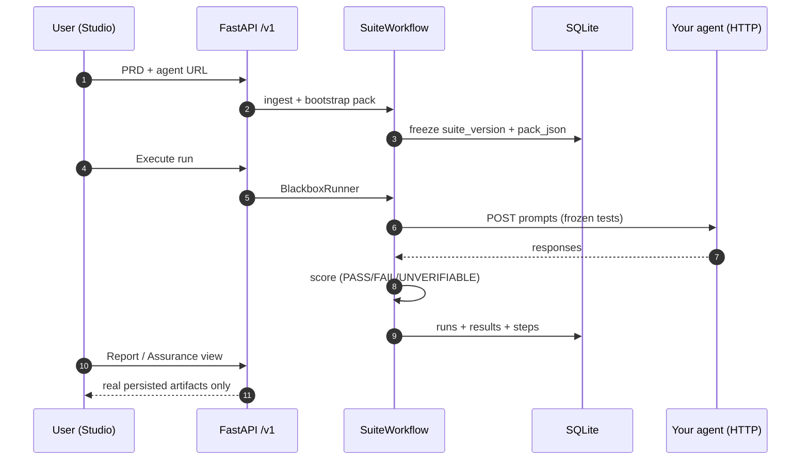

# AgentEval

**Turn a product spec and an agent URL into a frozen assurance suite — with evidence-backed verdicts, not vibes.**

[](LICENSE)
[](https://www.python.org/downloads/)

AgentEval is an open-source **agent assurance platform**: it ingests requirements, generates and optimizes tests, runs them against your agent over HTTP (or harness/sandbox profiles), and records **PASS / FAIL / UNVERIFIABLE** with sealed evidence. The Web Console, REST API, and SQLite persistence share one engine — no parallel “demo” data paths.

Built as a **portfolio-grade system**: domain model, ADRs, migration plan, and a deliberate wedge for **small teams in regulated industries** (fintech → insurance → health) who need proof, not just dashboards.

---

## Table of contents

- [Why this exists](#why-this-exists)
- [What we solve](#what-we-solve)
- [What’s wrong with most “eval” tools today](#whats-wrong-with-most-eval-tools-today)
- [How AgentEval is different](#how-agenteval-is-different)
- [How it works (end-to-end)](#how-it-works-end-to-end)
- [What’s shipped vs what’s next](#whats-shipped-vs-whats-next)
- [Architecture & key decisions](#architecture--key-decisions)
- [Quick start](#quick-start)
- [Verify it works](#verify-it-works)
- [Roadmap & expansion](#roadmap--expansion)
- [Documentation index](#documentation-index)
- [License](#license)

---

## Why this exists

Teams ship agents that **call tools, move money, open tickets, and change databases**. Production failures are rarely “the final string was ugly.” They are:

- wrong tool or args,
- silent side effects,
- regressions after a prompt change,
- “looks fine” demos that never tested edge cases.

Most teams still **spot-check chats**, run occasional LLM-as-judge scores, or buy observability platforms that **watch** production — without a **repeatable, sign-off-ready** link from **requirements → tests → evidence → verdict**.

AgentEval exists to close that gap: **requirements-first assurance** with honest limits (`UNVERIFIABLE` when proof is missing), a **frozen suite** for CI and releases, and a path to **domain packs** (finance, insurance, health) without forking the core product.

---

## What we solve

| Stakeholder | Job to be done |
|-------------|----------------|
| **Engineer / QA (U1)** | Connect the agent once; run a frozen suite; debug failures with real observations and trajectories |
| **Product / compliance lead (U2)** | Approve requirements; sign a report auditors can read (per requirement / control, not a single “vibe score”) |
| **CI (U3)** | Block release when mandatory checks fail — same evidence, same verdict on every run |

**Primary wedge (documented, building toward):** companies with **~10–200 people** in **regulated** spaces deploying **customer-facing agents**. They are underserved by enterprise red-team services and by SMB tools that only produce paperwork. See [idea one-pager §8](docs/ideas/agent-assurance-platform.md).

**Default product path:** **PRD + agent URL → create suite → run → HTML report** ([MVP checklist](docs/MVP.md)). No YAML matrices required for onboarding.

---

## What’s wrong with most “eval” tools today

| Gap | Typical market response | AgentEval stance |
|-----|------------------------|------------------|
| **Final-answer scoring** | LLM judges on output text | Trajectory + observable evidence; black-box HTTP when that’s all you have |
| **No requirements traceability** | Ad-hoc datasets | Stable requirement IDs; sync prunes tests when requirements disappear |
| **Silent passes** | Missing proof → pass | **`UNVERIFIABLE`** — never guess |
| **Demo UI** | Fake replay / placeholder runs | Console reads **API + SQLite only** ([CONSTRAINTS](CONSTRAINTS.md)) |
| **Domain baked into core** | Refund/ticket logic in platform code | **Backbone + packs** — domain plugs in ([ADR-005](docs/decisions/ADR-005-backbone-domain-packs-source-of-truth.md)) |
| **Engine reinvention** | Custom eval frameworks | **Inspect AI** as execution engine ([ADR-001](docs/decisions/ADR-001-build-on-inspect-ai.md)) — integration in progress |
| **Platform sprawl** | Full LLMOps (traces, prompts, datasets, agents) | **Assurance appliance** — selective adoption, not parity chasing ([DR-023](docs/engineering-ledger/decisions.md#dr-023--langwatch-oss-architecture-lessons-assurance-appliance-vs-llmops-platform)) |

---

## How AgentEval is different

1. **Requirements → frozen suite** — Ingest markdown PRD; generate candidate pool; optimize pack (set cover + mandatory floors); **freeze** version in SQLite.
2. **Evidence-backed verdicts** — Black-box runs store HTTP observations, rationales, and execution steps; harness path can assert **state diffs** (ΔS) where sandbox is available.
3. **Spec drift** — Explicit **suite sync**: removed capabilities prune tests; fingerprint and changelog are persisted ([ADR-003](docs/decisions/ADR-003-black-box-test-intelligence-pipeline.md)).
4. **Pluggable domain** — Packs add mandatory requirements, compliance mappings, scenarios, and checks without changing backbone code (design complete; first fintech pack in progress).
5. **One stack, three surfaces** — `agenteval/` library + Pydantic → **FastAPI `/v1/suites/*`** → **React console**; Typer CLI for `serve`, engineering, and CI.

---

## How it works (end-to-end)



**Conceptual domain model** (full ER diagram): [docs/design/domain-model.md](docs/design/domain-model.md)

```text
Specification → Requirements → Acceptance criteria → Test cases
       ↓ frozen as SuiteVersion
Run (one target) → Case execution → Evidence → Criterion verdicts → Report
       ↑
Domain pack (fintech, …) adds requirements, controls, checks
```

---

## What’s shipped vs what’s next

| Area | Status | Notes |
|------|--------|--------|
| Web Console (Studio, Assurance, Replay, report embed) | **Shipped** | [MVP](docs/MVP.md) slices M1–M4 |
| `agenteval serve` + `/v1/suites/*` | **Shipped** | UI-first delivery [DR-021](docs/engineering-ledger/decisions.md) |
| SQLite `SuiteRepository` + import from JSON | **Shipped** | [ADR-004](docs/decisions/ADR-004-sqlite-local-persistence.md) |
| PRD ingest → AgentCard → pool → optimized pack | **Shipped** | Black-box pipeline [ADR-003](docs/decisions/ADR-003-black-box-test-intelligence-pipeline.md) |
| Stable requirement IDs (`req-…`) + suite sync remap | **Shipped** | FR-B-02; [requirement_ids.py](agenteval/core/requirement_ids.py) |
| SQLite v2 additive migration (targets, requirements tables, …) | **Partial** | [migrations.py](agenteval/db/migrations.py); normalized rows on freeze **next** |
| Per-criterion verdicts + evidence items in DB | **Designed** | [persistence-schema v2](docs/design/persistence-schema.md) |
| Inspect AI execution + EvalLog mirror | **Accepted, not wired** | [ADR-001](docs/decisions/ADR-001-build-on-inspect-ai.md), [ADR-005](docs/decisions/ADR-005-backbone-domain-packs-source-of-truth.md) |
| Fintech domain pack | **Planned** | First pack after backbone boundary cleanup |
| Multi-tenant auth / SaaS | **Roadmap** | PRD epics E-AUTH, E-ORG |

---

## Architecture & key decisions

We document **why**, not only **what** — so reviewers can follow the engineering story.

### End-to-End System Architecture

```mermaid
graph TB
    subgraph S1["1. INGESTION & AUTO-RECOMMENDATION"]
        PRD["PRD / Spec (Markdown / OpenAPI / AgentCard)"] --> Ingestor["Requirements Ingestor & Parser"]
        Ingestor --> ArchetypeClassifier["Archetype Classifier\n(Financial, Support, Code, Retrieval)"]
        ArchetypeClassifier --> Router["Recommendation Brain (MetricRouter)\n- Selects DeepEval Metrics\n- Selects PromptFoo Attack Plugins\n- Selects Invariant Floors (25 Templates)"]
    end

    subgraph S2["2. CANDIDATE TEST GENERATION"]
        Router --> GenPool["Candidate Generation Layer"]
        GenPool --> RuleGen["Invariant Floor Generator\n(BOLA, Data Isolation, Idempotency)"]
        GenPool --> PromptFooBridge["PromptFoo Adversarial Bridge\n(Jailbreaks, Injections, PII Leaks)"]
        GenPool --> DomainPacks["Domain Pack Synthesizer\n(e.g., Fintech Refund Audit)"]
        GenPool --> LLMSynth["PRD Requirements Synthesizer\n(Edge-case generator)"]
        RuleGen --> RawPool["Raw Candidate Test Pool\n(100 - 500 Tests)"]
        PromptFooBridge --> RawPool
        DomainPacks --> RawPool
        LLMSynth --> RawPool
    end

    subgraph S3["3. HUMAN-IN-THE-LOOP TIERED CURATION"]
        RawPool --> JevScorer["Jev Multi-Axis Scorer\n(Severity, Novelty, Cost, Flakiness)"]
        JevScorer --> Bucketer["Priority Tier Bucketer\n- P0: Critical Invariant Floors\n- P1: Core Business Workflows\n- P2: Extended Adversarial Fuzzing"]
        Bucketer --> BudgetCurve["Marginal Coverage Calculator\n(e.g., 30 tests=60%, 75 tests=85%, 150 tests=98%)"]
        BudgetCurve --> WebStudio["Web Studio UI (agenteval serve)\n- Interactive Budget / Coverage Slider\n- Per-test Inspector & Toggles\n- User 'Freeze Suite' Sign-Off"]
        WebStudio --> FrozenSuite["Frozen Test Suite (v1.0)\n(Immutable JSON + SHA-256)"]
    end

    subgraph S4["4. HYBRID EXECUTION & EVIDENCE ENGINE"]
        FrozenSuite --> Dispatcher{"Execution Dispatcher\n(Inspect Sandbox Required?)"}
        
        Dispatcher -- "No (API / Microservice)" --> NativeRunner["Lean Native Blackbox Runner\n- Direct HTTP / REST / MCP\n- Sub-second invocation\n- Zero heavy dependencies"]
        Dispatcher -- "Yes (Code / Shell / UK AISI)" --> InspectBridge["Pluggable Inspect AI Bridge\n- Docker / microVM Sandboxes\n- UK AISI Benchmarks (GAIA, SWE)\n- EvalLog Transcripts"]
        
        TargetAgent["Target Agent Under Test\n(Live Service, Container, or Model)"]
        NativeRunner <--> TargetAgent
        InspectBridge <--> TargetAgent

        TargetAgent --> StateDiffCapture["Environmental State-Diff Engine (ΔS)\n- PostgreSQL / SQLite queries\n- File system diffs\n- Kafka / Event log probes"]
    end

    subgraph S5["5. EVALUATION MESH & VERDICTS"]
        NativeRunner --> EvalMesh["Multi-Axis Evaluation Mesh"]
        InspectBridge --> EvalMesh
        StateDiffCapture --> EvalMesh

        EvalMesh --> ObservableScorer["Observable Scorer (HTTP, Contract, Token)"]
        EvalMesh --> StateDiffScorer["StateDiffScorer (Sealed Proof Assertions)"]
        EvalMesh --> DeepEvalScorers["DeepEval Bridge\n(ToolCorrectness, PlanAdherence)"]

        ObservableScorer --> Aggregator["Verdict Aggregator"]
        StateDiffScorer --> Aggregator
        DeepEvalScorers --> Aggregator

        Aggregator --> Verdicts["Deterministic Verdicts\n- PASS (Verified Proof)\n- FAIL (Invariant Violated)\n- UNVERIFIABLE (Proof Missing)"]
    end

    subgraph S6["6. AUDIT STORAGE & REPORTING"]
        Verdicts --> SQLiteStore[("Local SQLite Database\n(Suite Versions, Runs, Executions, Proofs)")]
        InspectBridge -.-> InspectLogs[("Inspect .eval Logs\n(Raw trajectory sidecar)")]
        SQLiteStore --> Dashboard["Web Assurance Dashboard & Diff View"]
        SQLiteStore --> AllureReport["Compliance Sign-Off Report (HTML / PDF)"]
        SQLiteStore --> CIGate["CI/CD Quality Gate (agenteval gate)"]
    end
```




| Decision | Choice | Rationale |
|----------|--------|-----------|
| **Product surface** | Web UI + API first, thin CLI | Same services for UI and CI; no duplicate business logic |
| **Persistence** | SQLite (local/CI); Postgres later | Single-node appliance; WAL; [ADR-004](docs/decisions/ADR-004-sqlite-local-persistence.md) |
| **Source of truth** | SQLite rows; Inspect log copied alongside | Queryable runs; audit trail; [ADR-005](docs/decisions/ADR-005-backbone-domain-packs-source-of-truth.md) |
| **Eval engine** | Inspect AI (MIT) | Research-grade tasks/samples/scorers; avoid custom loop |
| **Domain** | Packs via entry points | Healthcare/finance wording never belongs in backbone |
| **Runs** | One target per run; baseline compare | Reproducible; clear sign-off unit |
| **Verdicts** | PASS / FAIL / UNVERIFIABLE | No silent passes ([CONSTRAINTS](CONSTRAINTS.md)) |
| **Personas (v5)** | Engineer + compliance sign-off + CI bot | [PRD §4](docs/design/PRD_SAAS_FULL.md) |
| **Not building** | Full LangWatch-style LLMOps | Focus assurance appliance [DR-023](docs/engineering-ledger/decisions.md) |

**Backbone requirements (draft):** [PRD §9A](docs/design/PRD_SAAS_FULL.md) — FR-B-01 through FR-B-23, pack contract FR-P-01–06.

---

## Quick start

### Prerequisites

- Python **3.11+**
- Node **18+** (for the console build or dev server)
- Optional: [uv](https://github.com/astral-sh/uv) for fast installs

### 1. Install

```bash
git clone https://github.com/DTiapan/AgentEval.git
cd AgentEval
uv pip install -e ".[dev]"
```

### 2. Build the console

```bash
cd web && npm install && npm run build && cd ..
```

### 3. Start API + UI (SQLite on by default)

```bash
agenteval serve
# → http://127.0.0.1:8766/#/console
```

API-only: `agenteval serve --no-ui`

### 4. Run a sample agent (separate terminal)

**Black-box mock (keyword refund bot):**

```bash
python3 examples/blackbox/refund_agent_server.py
# listens on http://127.0.0.1:8765
```

In Studio: paste a PRD (e.g. `examples/blackbox/refund-agent-prd.md`), set endpoint `http://127.0.0.1:8765/chat`, create suite, run Assurance.

**Richer sample (OpenAI tools + SQLite side effects):**

See [examples/real-agent/README.md](examples/real-agent/README.md) — copy `.env.example` → `.env`, run `ops_agent_server.py` on port **8770**.

**Multiple mocks:**

```bash
./examples/blackbox/start_sample_agents.sh
```

### 5. Local UI hot reload (optional)

```bash
# Terminal A
agenteval serve --no-ui

# Terminal B
cd web && npm run dev
# → http://localhost:5173 (proxies API on 8766)
```

### 6. Reset local database

```bash
agenteval db reset --yes
```

---

## Verify it works

**Console:** Studio → create suite → Assurance → **Execute Run** → open HTML report.

**API:**

```bash
curl -s http://127.0.0.1:8766/v1/suites | jq '.suites | length'
curl -s http://127.0.0.1:8766/v1/suites/<agent_id>/runs/latest | jq '.passed, .failed, .unverifiable'
```

**Tests:**

```bash
.venv/bin/pytest tests/unit -q --no-cov
.venv/bin/pytest tests/e2e/test_blackbox_suite_mvp.py -q --no-cov
```

**Import existing JSON suites into SQLite:**

```bash
agenteval db import
```

---

## Roadmap & expansion

Phases are **shippable slices**, not “foundation only” releases ([ROADMAP](docs/ROADMAP.md)).

| Phase | Focus | Time horizon (indicative) |
|-------|--------|---------------------------|
| **Now (v0.2.x)** | Honest console, SQLite SoT, PRD→suite→run, reports, stable requirement IDs | Shipped / polishing |
| **Next** | Normalized requirements & per-criterion verdicts in DB; runner writes evidence rows | Weeks |
| **Then** | Inspect AI wiring + EvalLog mirror; fintech pack v1 | Weeks–months |
| **v1** | Insurance pack; compliance-grouped reports; CI templates | Months |
| **v1.x** | Auth, workspaces, API keys (SaaS PRD) | Months |
| **Later** | Health pack; harness chaos + ΔS for in-process agents; OTel alignment | Quarters |

**What takes time (by design):**

- **Domain packs** — regulation mapping, synthetic data, and side-effect probes must be correct, not marketing.
- **Evidence sealing** — every PASS must cite proof; schema and UX must match.
- **Inspect migration** — run existing workflows through Tasks/Samples/Scorers without breaking SQLite/API contracts.
- **Boundary enforcement** — CI fails if backbone imports domain vocabulary (NFR-B-07).

---

## Documentation index

| Doc | Purpose |
|-----|---------|
| **[DESIGN_INDEX.md](docs/design/DESIGN_INDEX.md)** | **Start here** — entities, schema, traceability, build order |
| [ROADMAP.md](docs/ROADMAP.md) | Version plan and execution guide |
| [requirements-traceability.md](docs/design/requirements-traceability.md) | FR-B / FR-P → schema → code → tests |
| [criterion-lifecycle.md](docs/design/criterion-lifecycle.md) | Acceptance criteria propose → score |
| [pack-interface.md](docs/design/pack-interface.md) | Domain packs + connectors contract |
| [MVP.md](docs/MVP.md) | Current product slice and verify steps |
| [domain-model.md](docs/design/domain-model.md) | Entities, relationships, invariants |
| [persistence-schema.md](docs/design/persistence-schema.md) | SQLite v2 tables and migration phases |
| [PRD_SAAS_FULL.md](docs/design/PRD_SAAS_FULL.md) | Full product requirements (incl. §9A backbone) |
| [agent-assurance-platform.md](docs/ideas/agent-assurance-platform.md) | Problem, positioning, deferred PM wedge |
| [engineering-ledger/decisions.md](docs/engineering-ledger/decisions.md) | Decision record index (DR-*) |
| [decisions/ADR-*.md](docs/decisions/) | Architecture decision records |
| [CONSTRAINTS.md](CONSTRAINTS.md) | Quality bar and behavioral contract |
| [AGENTS.md](AGENTS.md) | Contributor / agent orchestration rules |

---

## Advanced: engineering CLI

Power users and CI — not the default onboarding path:

```bash
agenteval suite init --prd path/to/requirements.md --endpoint http://127.0.0.1:8080/chat
agenteval suite sync --agent-id my-agent --manifest agent.yaml --prd path/to/requirements.md
agenteval run --scenario examples/scenarios/   # harness / YAML profile
```

---

## Contributing

Issues and PRs welcome. Read [CONSTRAINTS.md](CONSTRAINTS.md) and [AGENTS.md](AGENTS.md) before large changes. Substantive design forks belong in an ADR under `docs/decisions/`.

---

## License

Apache-2.0 — see [LICENSE](LICENSE).

---

<p align="center">
  <strong>AgentEval</strong> — requirements in, evidence out.<br/>
  Built with explicit decisions, a domain model, and tests that match what the console shows.
</p>
