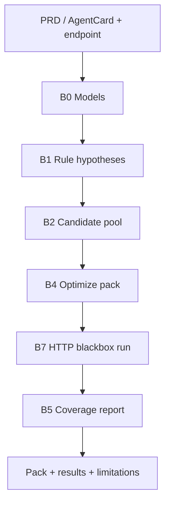

# AgentEval — Product Roadmap & Execution Guide

> **North Star**: One tool to attack all planes of AI agent assurance — evaluation, trajectory verification, tool-call validation, sandbox side-effect proof, golden dataset curation, observability, and CI/CD quality gates.
>
> **Delivery Philosophy**: Every version is a **working, shippable product**. No version is a "foundation only" release. Each version solves a real problem end-to-end, and the next version expands the blast radius.

---

## The Burning Problem We Solve

Every team shipping AI agents today is flying blind:
- They can't **prove** their agent actually did what it claims.
- They can't **catch regressions** before production.
- They can't distinguish **"it worked"** from **"it got lucky."**
- They have **zero visibility** into the reasoning trajectory — only the final output.
- Their "testing" is running the agent a few times and eyeballing the result (**vibes-based QA**).

AgentEval gives them **sealed, deterministic proof — or honestly tells them when proof is impossible.**

### Market Validation (2026)
- Only **~16%** of enterprise agent projects qualify as true autonomous agents; **quality is the #1 barrier to production** (Menlo Ventures / LangChain State of AI Agents 2026).
- AI Agent Audit & Assurance market: **~$0.6B in 2026 → projected $23B by 2036** (FactMR).
- **EU AI Act** (August 2026) legally requires evidence-based assurance for autonomous agents in regulated sectors.
- EY, Deloitte, NVIDIA (NemoClaw), and TestMu AI all launched agent assurance products in 2026 — the big money confirms the pain.

### Our Moat (What Nobody Else Does)
| Differentiator | Why It Matters |
|---|---|
| **Sealed Execution Evidence** | We assert *actual environment mutations* (files created, DB rows committed, API calls made) — never trust an agent's self-report. |
| **Explicit `UNVERIFIABLE` Verdict** | Every other tool silently passes or guesses. We refuse to claim something we can't prove. |
| **Auto-Mining Production Failures → Golden Datasets** | Turns the platform into a flywheel: production incidents automatically become regression tests. |
| **Deterministic First, LLM Judge Second** | Cheap/reliable assertions fire first ($0 cost, 100% reproducible). LLM judge is opt-in for subjective criteria only. |
| **True BYOA (Bring Your Own Agent)** | Any agent — HTTP, MCP, Python callable, CLI binary — plugs in with zero code changes. We own everything downstream. |

---

## Competitive Landscape & Positioning

### Direct Competitors & Adjacent Players

| Player | What They Do | Their Strength | Their Gap (Our Opportunity) |
|---|---|---|---|
| **DeepEval** | Pytest-style LLM evaluation library | Great DX, 50+ metrics, CI/CD native | Output-string focused. No trajectory verification, no side-effect proof, no sandbox execution. |
| **LangSmith** | LangChain's tracing + evaluation platform | Deep LangGraph integration, trajectory visualization | Locked to LangChain ecosystem. Passive monitoring — doesn't actively execute and assert. |
| **Arize Phoenix** | OTel-based LLM observability | Strong ML infra team adoption, open-source tracing | Observability only. Doesn't run evaluations, doesn't generate golden datasets, doesn't gate CI. |
| **Braintrust** | Framework-neutral eval platform | Enterprise portability, clean API | No sandbox execution, no environmental side-effect verification. |
| **Maxim AI** | Multi-turn agent simulation & QA | Polished UI, persona-based testing | Cloud SaaS lock-in. No local-first CLI, no deterministic state diffing. |
| **TestMu AI (formerly LambdaTest)** | AI Assurance + Kane CLI + Agentic Testing | Requirement-linked lifecycle, browser automation | Proprietary cloud platform. Heavy enterprise pricing. No open-source core. |
| **NVIDIA NemoClaw / OpenShell** | Agent runtime security & sandbox isolation | Kernel-level Landlock/seccomp isolation, privacy routing | Security-focused, not evaluation-focused. Doesn't score trajectories or generate test suites. **Complementary to us.** |
| **NeMo Guardrails** | Conversational safety rails (Colang policies) | Jailbreak detection, topical boundaries, hallucination checks | Guards *what an agent says*, not *what an agent did*. Orthogonal to our trajectory + side-effect verification. |

### Where AgentEval Sits

```
                    ┌─────────────────────────────────────────────────────┐
                    │              AGENT LIFECYCLE                        │
                    │                                                     │
 ┌──────────┐  ┌───┴──────┐  ┌──────────┐  ┌──────────┐  ┌──────────┐  │
 │  BUILD   │→ │  TEST    │→ │  DEPLOY  │→ │ MONITOR  │→ │  LEARN   │  │
 │          │  │          │  │          │  │          │  │          │  │
 │ Frameworks│ │ AgentEval│  │ NemoClaw │  │ Phoenix  │  │ AgentEval│  │
 │ LangGraph│  │ DeepEval │  │ OpenShell│  │ LangSmith│  │ (mining) │  │
 │ CrewAI   │  │ Braintrust│ │ E2B      │  │ AgentOps │  │          │  │
 └──────────┘  └──────────┘  └──────────┘  └──────────┘  └──────────┘  │
                    │                                                     │
                    │  AgentEval spans TEST + MONITOR + LEARN            │
                    │  (the full assurance lifecycle)                     │
                    └─────────────────────────────────────────────────────┘
```

---

## Architecture Overview (All Planes)

AgentEval attacks **nine planes** of agent assurance, requirement engineering, and production reliability through a single unified platform:

| Plane | What It Covers | Key Components |
|---|---|---|
| **0. Agent Contract, Discovery & Requirements** | Auto-discover tools, ingest natural language PRDs, dynamically synthesize stack-ranked personas (LiteLLM), manage `AgentCard` manifests, **black-box test pack intelligence** (understand → hypothesize → optimize → coverage) | DynamicPersonaGenerator (LiteLLM + 5-Tier Stack-Ranking), PRD-to-Scenario Compiler, MCP/OpenAPI Auto-Introspector, Declarative `AgentCard` Manifest, **Agent Test Model (DECLARED / INFERRED / HYPOTHESIZED)**, **Candidate Test Pool + Set-Cover Optimizer**, **Multi-Axis Coverage & Gap Loop** ([design spec](design/black-box-test-intelligence-pipeline.md)) |
| **1. Pluggable Agent Interface (BYOA)** | Connect any agent (in-process, HTTP, MCP, CLI) with zero code changes | `HTTPAdapter`, `MCPAdapter`, `CallableAdapter`, `CLIAdapter` |
| **2. Trajectory & Agent Loop Verification** | Validate the multi-turn loop, iteration limits, thrashing, and tool sequences | `ToolSequenceEvaluator`, `StepEfficiencyEvaluator`, Loop/Thrashing Guard |
| **3. Sandbox & Side-Effect Proof** | Execute tools in isolation, capture state diffs ($\Delta S$), assert mutations | Ephemeral sandbox (local → OpenShell/Docker), `StateDiffEvaluator` |
| **4. Chaos Engineering & Fault Injection** | Inject synthetic faults into tools, network, state, and context | `ToolFaultInjector`, `CrashRecoveryHarness`, `ContextPressureInjector`, `IdempotencyScorer` |
| **5. Hybrid Evaluation Engine & Metric Router** | Archetype-aware metric selection, deterministic checks, Jev fast judge, calibrated LLM rubrics via LiteLLM multi-vendor gateway | LiteLLM Gateway (100+ model providers), Jev-Powered Metric Router, Archetype Profiles (Tool, RAG, Code, Support), Deterministic assertions ($0), Jev System One typed scoring ($0.04/M), calibrated G-Eval |
| **6. Real-Time & Interactive Replay** | Replay runs in real-time or step-by-step; time-travel debugging | `agenteval replay`, Live Streaming Engine, Time-Travel Scrubber, Side-by-Side Diff Player |
| **7. Continuous Golden Dataset Loop** | Auto-mine production traces into regression suites with 12-class error taxonomy | Production trace ingestion, failure clustering, adversarial synthesis |
| **8. Observability, Economics & CI/CD Gate** | Telemetry, cost-per-success, latency breakdown, and PR regression gating | OTel/OpenInference, latency/cost breakdown, CLI exit codes, GitHub Actions PR bot |

### Agent Archetype to Metric Matrix (Segregation & Selection)

Different agents require completely different assurance lenses. AgentEval segregates evaluation dimensions by **Agent Archetype**, routed automatically by the Jev classifier or declared via `AgentCard`:

| Agent Archetype | Key Characteristics | Active Assurance Planes | Core Evaluation Metrics & Scorers |
|---|---|---|---|
| **Tool-Using Action Agent** (e.g. Order fulfillment, DB ops, DevOps) | Multi-turn loops, state-mutating tools, external API dependencies | Planes 2, 3, 4, 6 | `ToolContractValidator`, `StateDiffEvaluator` ($\Delta S$), `IdempotencyScorer` (`duplicate_side_effect_rate`), `LoopThrashingGuard`, Chaos recovery rate |
| **RAG / Knowledge Agent** (e.g. Research, Q&A, Doc Search) | Vector retrieval, document chunking, synthesis | Planes 5, 8 | `FaithfulnessScorer` (groundedness in retrieved chunks), `ContextPrecisionScorer`, `ContextRecallScorer`, `HallucinationIndex`, `SemanticDriftScorer` |
| **Coding / Patch Agent** (e.g. SWE-bench, Bug fixer) | Repo modifications, unit test execution, diff generation | Planes 2, 3, 5 | `PatchSyntaxValidator`, `UnitTestDeltaScorer` (tests passed before vs after), `StaticAnalysisScorer` (lint/type clean), `FileMutationScopeGuard` |
| **Enterprise Support Agent** (e.g. Customer Care, Account Help) | Conversational, policy-bound, auth checks, human handoff | Planes 0, 4, 5, 8 | `HITLPolicyEvaluator` (escalates before irreversible actions), `PIILeakageScorer`, `ToneEmpathyRubric`, `SafetyGuardrailCompliance` |
| **Multi-Agent Swarm** (e.g. Planner + Coder + Reviewer) | Inter-agent delegation, message routing, shared memory | Planes 2, 6, 8 | `HandoffSuccessRate`, `DeadlockDetector`, `InterAgentRedundancyScorer`, `MessageVolumeCostBreakdown` |

## Black-Box Test Intelligence (Must-Have vs Later)

> **Decision:** [ADR-003](decisions/ADR-003-black-box-test-intelligence-pipeline.md) — Full north-star spec: [black-box-test-intelligence-pipeline.md](design/black-box-test-intelligence-pipeline.md) (includes [test generation strategy](design/black-box-test-intelligence-pipeline.md#test-generation-strategy): rules-first pool, optional LLM for personas/understanding, optimizer selects pack). Checklist: [AP-003](engineering-ledger/attack-plans.md#ap-003-black-box-test-intelligence-pipeline-v02v03).

**Product moat (unchanged):** Smallest high-value test pack—not “generate and run everything.” **Must-have** ships a credible black-box loop; **later** deepens risk, metrics, automation, and harness breadth without blocking the MVP.

### Must-have — v0.2 Black-Box MVP

Minimum story: *spec + HTTP endpoint → candidate pool → optimized pack → run → coverage summary + limitations.*

| Slice | What ships | Why must-have |
|-------|------------|---------------|
| **B0** | `AgentTestModel`, `CandidateTest`, coverage tags, **DECLARED / INFERRED** provenance | Shared language for plan + run |
| **B1** | **Rule-based** failure hypotheses (templates per capability; no LLM required) | Pool generation without cost explosion |
| **B2** | Candidate pool: capability × hypothesis × **bounded personas** (reuse `--top-personas`, not full combinatorics) | Separates pool from execution |
| **B4** | Mandatory security **floor** (when applicable) + **greedy set cover**; pool ≫ pack stats | Core differentiator |
| **B5 (MVP)** | **Post-run coverage map** + **critical uncovered** list (report only; no auto regen) | Honest coverage without gap automation |
| **B7** | `blackbox` profile + `ObservationBundle` on **`HTTPAdapter`** | Enterprise default path |
| **B8 (MVP)** | `agenteval plan` → pool/pack preview; **`suite init`** (generate once + persist); **`suite run`** (regression, no regen) | End-to-end CLI + frozen suite ([DR-010](engineering-ledger/decisions.md#active-index)) |

**MVP user outputs (subset of full §16 spec):**

| Output | MVP |
|--------|-----|
| Agent test profile (with provenance) | ✓ |
| Optimized test pack | ✓ |
| Execution results (observable) | ✓ |
| Coverage (key axes: capability, persona, failure-mode, security) | ✓ |
| Confidence / limitations (`UNTESTABLE`, no false ΔS claims) | ✓ |
| **Rich run report** (Allure-class HTML: suites, categories, steps, attachments) | Later (v0.3+); aligns with dashboard |
| Full risk map, metric rationale deck, automated gap re-test | Later |

**Run reporting today (MVP):** `suite run` prints a Rich summary table (test id, verdict, rationale snippet) and writes machine-readable JSON to `.agenteval/suites/<agent_id>/latest_run.json` and `runs/<run_id>.json`. Join `test_id` → `test_pack.json` for name/category. **Not in scope:** flat CI exports (JUnit XML, CSV). **Later:** interactive HTML report (Allure-style narrative: hierarchy, history, drill-down)—same evidence model the web dashboard will use, not a separate “spreadsheet” path.



### Later — after Black-Box MVP

| Slice / theme | When | Notes |
|---------------|------|-------|
| **B3** | v0.3 | Full configurable risk dimensions (impact, likelihood, exposure, …)—MVP uses simple priority weights inside B4 |
| **B5 (full)** | v0.3 | **Gap loop:** targeted new candidates → re-optimize (incremental pack extension) |
| **Suite prune** ([DR-011](engineering-ledger/decisions.md#active-index)) | v0.3 (`suite sync`); tags in v0.2 | Drop/archive tests when capability **removed** from spec; extend only for new caps |
| **B6** | v0.3 | Metric applicability on model + pack; trim `MetricRouter` to observable scorers only |
| **B9** | v0.3 | Inspect AI plan compiler (`@task` / scorers)—after `ObservationBundle` is stable |
| **B8 (full)** | v0.3+ | Rich CLI/report: risk map, metric “why selected,” efficiency dashboards |
| **Suite run report (Allure-class)** | v0.3+ | Self-contained HTML from `SuiteRunReport` + pack: suite → category → case, verdict, rationale, prompt/response attachments; optional history; shared schema with assurance dashboard—not JUnit/CSV |
| **LLM hypothesis expansion** | v0.3+ | Optional LiteLLM-generated failure modes beyond rule templates |
| **HYPOTHESIZED** provenance layer | v0.3+ | Explicit hypothesis objects in Agent Test Model (MVP can tag via candidate metadata) |
| **Non-HTTP protocols** (MCP, CLI adapters) | v0.3+ | Black-box MVP is **HTTP-only**; harness + other adapters stay separate |
| **Harness reliability** (crash recovery, context pressure, advanced faults, $pass^k$, replay export) | v0.3+ | Valuable for **harness** profile; not required to prove black-box pack value |

**Harness profile (v0.1, opt-in):** `LocalSandbox`, `ToolFaultInjector`, `StateDiffEvaluator`—for in-process BYOA; not part of Black-Box MVP.

---

### Verdict Taxonomy (Core Innovation)
Every evaluation produces one of four explicit verdicts:

| Verdict | Meaning | When It Fires |
|---|---|---|
| `PASS` | All assertions met with sealed evidence | Deterministic checks + state diffs + (optional) LLM judge all agree |
| `FAIL` | Explicit logic, safety, or assertion failure | Wrong tool called, schema violation, state diff mismatch, safety breach |
| `UNVERIFIABLE` | Agent claimed completion but proof is missing | Side-effect cannot be observed (e.g., external API with no mock, no audit trail) |
| `ANOMALOUS` | Task completed but with concerning signals | Excessive token usage, loop/backtrack detected, extreme latency |

---

## Foundation Strategy: Build on Inspect AI

> **Decision**: [ADR-001](../decisions/ADR-001-build-on-inspect-ai.md) — Use UK AISI's `inspect_ai` (MIT license) as the evaluation engine core. Build our unique IP as Inspect extensions. Import DeepEval metrics as optional complements.

### Why Inspect AI
- **MIT-licensed**, government-backed (UK AI Safety Institute), actively maintained
- Composable `@task` / `@solver` / `@scorer` / `@tool` primitives — our extensions are standard Python
- Docker/K8s sandbox infrastructure built-in (extensible to OpenShell)
- Full transcript/trajectory capture and log system
- `inspect view` web viewer + VS Code extension for trajectory visualization
- 200+ pre-built benchmarks via `inspect_evals` (GAIA, SWE-bench, CyBench, BFCL)

### Architecture Stack

```
┌─────────────────────────────────────────────────────┐
│              AgentEval (Our Platform)                │
│                                                     │
│  ┌─────────────────────────────────────────────┐   │
│  │ BYOA Adapter Layer (our IP)                  │   │
│  │ Wraps any agent as an Inspect AI Solver      │   │
│  └──────────────────────┬──────────────────────┘   │
│                         │                           │
│  ┌──────────────────────▼──────────────────────┐   │
│  │ Inspect AI Core Engine (reused)              │   │
│  │ @task, @solver, @scorer, sandbox, transcript │   │
│  └──────────────────────┬──────────────────────┘   │
│                         │                           │
│  ┌──────────────────────▼──────────────────────┐   │
│  │ AgentEval Custom Scorers (our IP)            │   │
│  │ • StateDiffScorer (sealed evidence)          │   │
│  │ • UnverifiableScorer (verdict taxonomy)      │   │
│  │ • SealedEvidenceScorer (env state proof)     │   │
│  │ • JevScorer (System One typed decisions)     │   │
│  │ + DeepEval metrics (optional import)         │   │
│  │   • ToolCorrectnessMetric                    │   │
│  │   • AgentLoopDetectionMetric                 │   │
│  │   • StepEfficiencyMetric                     │   │
│  └──────────────────────┬──────────────────────┘   │
│                         │                           │
│  ┌──────────────────────▼──────────────────────┐   │
│  │ AgentEval Extensions (our IP)                │   │
│  │ • OpenShell sandbox backend                  │   │
│  │ • Production trace → dataset miner           │   │
│  │ • CI/CD quality gate & PR bot                │   │
│  │ • Adversarial scenario generator             │   │
│  │ • Drift detection (6 drift modes)            │   │
│  └─────────────────────────────────────────────┘   │
└─────────────────────────────────────────────────────┘
```

### What We Reuse vs. What We Build

| Layer | Reuse | Build (Our IP) |
|---|---|---|
| **Task Runner** | Inspect AI `@task` + `inspect eval` CLI | Our `agenteval run` wrapper with Rich output |
| **Agent Execution** | Inspect AI `@solver` primitive | BYOA Adapter Layer (HTTP, MCP, CLI, Callable → Solver) |
| **Evaluation** | Inspect AI `@scorer` + DeepEval metrics (opt-in) | `StateDiffScorer`, `SealedEvidenceScorer`, `UnverifiableScorer`, `JevScorer` |
| **Sandbox** | Inspect AI Docker sandbox | OpenShell backend plugin, local tempfile sandbox |
| **Transcript** | Inspect AI log system | Production trace → Inspect dataset converter |
| **Visualization** | `inspect view` web viewer | Custom dashboard (v0.5) |
| **Benchmarks** | 200+ via `inspect_evals` | Custom benchmark integration |

---

## Evaluation Techniques & Research Foundation

Our evaluator design is grounded in the latest research. This section documents the techniques we adopt, their academic backing, and which version introduces them.

### Tiered Judge Architecture

We implement a **three-tier judge architecture** that optimizes for cost, speed, and accuracy:

| Tier | Judge Type | Cost | Latency | When to Use | Version |
|---|---|---|---|---|---|
| **Tier 0** | Deterministic code checks (schema validation, state diffs, regex) | $0 | <1ms | Always — first line of defense | v0.1 |
| **Tier 1** | **Jev (TypeSafe AI System One)** — typed classification, scoring, boolean decisions | ~$0.04/M tokens | 70–500ms | High-volume structured decisions: tool correctness, policy compliance, safety classification | v0.3 |
| **Tier 2** | **LLM-as-a-Judge** (GPT-4o, Claude, Gemini) — Chain-of-Thought reasoning | ~$5–15/M tokens | 1–5s | Subjective criteria: helpfulness, reasoning quality, nuanced policy adherence | v0.3 |

### Jev (TypeSafe AI System One) Integration

**What**: Jev is a "System One" model by TypeSafe AI (released September 2026) optimized for fast, typed decision-making. It does not generate prose — it evaluates input against predefined questions and returns structured, probabilistic verdicts in a single parallel pass.

**Why it matters for AgentEval**: Traditional LLM-as-a-Judge is expensive ($5–15/M tokens) and slow (1–5s per eval). Jev is **40–200x faster** and **40–400x cheaper** while matching human-level accuracy on narrow classification tasks. This is perfect for high-volume, production-grade scoring.

**Three Jev Primitives we use**:

| Primitive | AgentEval Use Case | Example |
|---|---|---|
| **Choice** | Tool selection correctness — "Did the agent pick the right tool from this list?" | `choice(options=["search_db", "call_api", "write_file"], state=tool_call)` |
| **Score** | Step quality rating — "Rate this reasoning step 1–5 on the rubric" | `score(rubric="1=irrelevant, 5=optimal", state=step_context)` |
| **Noul (Boolean)** | Binary safety checks — "Was a destructive action performed?" "Did the agent violate the policy?" | `noul(question="Did the agent access unauthorized data?", state=trajectory)` |

**Confidence Gating Pattern**: When Jev's confidence is below a threshold (e.g., 0.7), automatically escalate to Tier 2 (full LLM judge). This gives us the speed of Jev for clear-cut cases and the reasoning depth of GPT-4o for ambiguous ones.

### Research-Backed Evaluation Techniques

#### 1. Compounding Error Detection
**Source**: *"A Survey for LLM Agent Trajectory Analysis: From Failure Attribution to Enhancement"* (TUM, July 2026)

A 1% error at an early step can snowball into catastrophic downstream failure. Our evaluators implement **step-level attribution** to pinpoint the specific tool call or decision that broke the chain, rather than just labeling the whole run as "failed."

**Implementation**: `FirstUnrecoverableStepScorer` — walks the trajectory backward from the failure point, testing each step's constraints to find the earliest violation that made recovery impossible.

#### 2. pass^k Consistency Metric
**Source**: τ-bench (Sierra Research), Anthropic reliability research

Unlike `pass@k` (at least one of k attempts succeeds — optimistic), `pass^k` measures whether the agent succeeds on **all** k attempts — the reliability floor.

| Metric | Formula | What It Measures | Our Use |
|---|---|---|---|
| `pass@k` | P(≥1 success in k tries) | Capability ceiling | Benchmark comparison |
| `pass^k` | P(all k succeed) = (c/n)^k | Reliability floor | Production readiness gate |

**Why it matters**: Research shows agents with 60% `pass@1` can drop to **25% `pass^3`** — exposing massive reliability gaps invisible to single-shot testing. We report both metrics.

#### 3. OAT (One-class Agent Tracing) — Unsupervised Failure Attribution
**Source**: *"Tracing Agentic Failure from the Flow of Success"* (arxiv, July 2026)

OAT trains only on **successful trajectories** using Neural Controlled Differential Equations (NCDEs), then detects anomalous steps in failure trajectories by comparing against the learned "normal flow." It's 200–5,000x faster than prompting-based baselines.

**Our adoption**: Phase v0.4+ — once we have enough successful trajectory data from the golden dataset, implement OAT-style anomaly scoring as an unsupervised evaluator that requires zero manual annotation.

#### 4. Six Drift Modes (Trace-Eval Gap)
**Source**: Future AGI research, industry consensus 2026

Static evaluation datasets go stale as production evolves. Six drift modes explain why agents pass offline evals but fail in production:

| Drift Mode | What Changes | Detection Strategy | Version |
|---|---|---|---|
| **Input-Distribution** | User queries shift from golden set distribution | Embedding distance monitoring | v0.4 |
| **Prompt-Template** | System prompt or few-shot examples updated | Hash-based version tracking | v0.3 |
| **Retrieval-Corpus** | Knowledge base grows, rotates, or is re-embedded | Retrieval quality regression tests | v0.4 |
| **Tool-Definition** | Agent's toolset changes (added/renamed/removed tools) | Schema diff against scenario expectations | v0.2 |
| **Judge-Calibration** | LLM judge model updates or rubric evolves | Periodic calibration against human labels | v0.3 |
| **Agent-Step Compounding** | Error accumulation across multi-step trajectories | `FirstUnrecoverableStepScorer` + `pass^k` | v0.2 |

#### 5. AgentRx Constraint-Based Attribution
**Source**: AgentRx framework (2026)

Synthesizes executable constraints from tool schemas and policies, then evaluates each trajectory step against them. Produces an auditable log of constraint violations with a grounded failure taxonomy. Improves step-level localization by ~75% over standard prompting.

**Our adoption**: The `SealedEvidenceScorer` already implements a version of this — we assert executable constraints (file exists, DB row matches, API response captured) rather than asking an LLM "did it work?"

#### 6. TraceElephant Full Observability
**Source**: TraceElephant benchmark (2026)

Demonstrated that attribution accuracy improves by **76%** when using full traces (inputs + reasoning + tool results) vs. partial observations (output-only). Validates our architectural decision to capture the complete trajectory, not just the final answer.

### Benchmark Integration Strategy

| Benchmark | Domain | Integration | Version |
|---|---|---|---|
| **GAIA** | General AI Assistant tasks | Via `inspect_evals` (free) | v0.1 |
| **SWE-bench Verified** | Software engineering agent tasks | Via `inspect_evals` (free) | v0.1 |
| **BFCL** (Berkeley Function Calling) | Tool-calling accuracy | Via `inspect_evals` (free) | v0.1 |
| **CyBench** | Cybersecurity agent tasks | Via `inspect_evals` (free) | v0.2 |
| **τ-bench** | Customer service (Retail, Airline, Banking) | Custom integration with `pass^k` | v0.2 |
| **ClawBench** | Real-world web agent tasks | Custom integration with trace evidence | v0.3 |

---

## Version Roadmap

### Sandbox Strategy Across Versions

| Version | Sandbox Approach | Rationale |
|---|---|---|
| **v0.1** | Inspect AI local sandbox + captured function call records | Leverages Inspect's built-in isolation |
| **v0.2** | + Mock HTTP server (local proxy for API call capture) | Enables REST agent tool verification |
| **v0.3** | + Optional NVIDIA OpenShell integration + Inspect Docker sandbox | Kernel-level isolation for destructive tool calls |
| **v0.4+** | + E2B / Modal as pluggable sandbox backends | Enterprise-grade, cloud-native isolation |

---

## v0.1 — "Prove the Thesis" (Working CLI)

> **Goal**: A developer can run `agenteval run` against their Python agent, see trajectory traces, get deterministic verdicts (`PASS` / `FAIL` / `UNVERIFIABLE`), and trust the result.
>
> **User Story**: *"I built a LangGraph agent that searches documents and answers questions. I want to know if it's calling the right tools with the right parameters, and whether it actually wrote the file it claims to have written."*

### What Ships
| Component | Scope | Files |
|---|---|---|
| **Core Domain Models** | `ExecutionTrace`, `StepRecord`, `ToolCall`, `ToolResult`, `StateSnapshot`, `Verdict`, `ReliabilityScorecard` | `agenteval/core/models.py` |
| **Agent Loop Engine & Metrics** | Tracks `agent_loop_iterations`, `duplicate_actions`, `termination_reason`, `tokens_consumed`, `time_to_completion` | `agenteval/core/loop.py` |
| **CallableAdapter** | In-process Python agent execution (LangGraph, CrewAI, any callable) | `agenteval/adapters/callable.py`, `agenteval/adapters/base.py` |
| **TrajectoryRecorder** | Event-bus capturing microsecond timestamps, state snapshots, tool arguments, and environment mutations per step | `agenteval/core/recorder.py` |
| **Tool Fault Injector (Basic)** | Intercepts tool calls between agent and environment; injects timeouts, HTTP 500, and fixed delays to evaluate agent recovery | `agenteval/faults/injector.py` |
| **ToolContractValidator** | Pre-execution validation of tool names, arguments, types, and parameter boundaries | `agenteval/evaluators/contract.py` |
| **Idempotency & Retry Scorer** | Detects whether tool retries after timeout create duplicate mutations (`duplicate_side_effect_rate`) | `agenteval/evaluators/idempotency.py` |
| **Scenario Loader** | YAML/JSON test scenario definitions with expected outcomes, initial state, and fault injection rules | `agenteval/scenarios/loader.py`, `agenteval/scenarios/schema.py` |
| **Basic Sandbox** | Temp directory + SQLite + function call capture | `agenteval/sandbox/local.py` |
| **ToolSchemaEvaluator** | Validates tool names and arguments against JSON schemas | `agenteval/evaluators/tool_schema.py` |
| **StateDiffEvaluator** | Compares pre/post environment state (files, DB rows) | `agenteval/evaluators/state_diff.py` |
| **Verdict Engine** | Aggregates evaluator scores → `PASS` / `FAIL` / `UNVERIFIABLE` | `agenteval/engine/verdict.py` |
| **CLI Runner & Live Stream** | `agenteval run --scenario tests/ [--live]` with real-time streaming step cards | `agenteval/cli/main.py` |
| **Interactive CLI Replayer** | `agenteval replay <run-id> [--tui \| --web \| --jump-to-fail]` (real-time playback, step navigation, failure spotlight) | `agenteval/cli/replay.py`, `agenteval/tui/replay_player.py` |
| **Example Agent + Test Suite** | A sample agent with test scenarios demonstrating the full reliability loop | `examples/` |

### What Doesn't Ship (Yet)
- HTTP, MCP, CLI adapters
- LLM-as-a-Judge evaluator
- `ANOMALOUS` verdict (needs efficiency baselines)
- Web dashboard (dedicated SPA)
- Production trace ingestion
- Adversarial dataset generation
- PR bot / CI reporter

### Definition of Done
- [ ] `pip install -e .` works
- [ ] `agenteval run --scenario examples/scenarios/` executes the sample agent, captures trajectory, asserts tool calls and state diffs, prints verdicts
- [ ] `agenteval run --live` streams step execution in real time with animated status
- [ ] `agenteval replay <run-id>` allows interactive step-by-step playback with `n` (next), `p` (prev), `space` (pause/play), and `--jump-to-fail`
- [ ] `agenteval replay <run-id> --web` launches browser-based trajectory viewer
- [ ] At least one clean `PASS`, one `FAIL`, and one `UNVERIFIABLE` example scenario
- [ ] At least one **Tool Fault Injection scenario** (e.g. injected timeout followed by agent recovery)
- [ ] At least one **Idempotency scenario** (detecting duplicate side-effects on retry)
- [ ] `pytest tests/` passes with ≥85% coverage on core modules
- [ ] README with quickstart that a developer can follow in < 5 minutes

### Tech Stack
| Layer | Choice | Why |
|---|---|---|
| Language | Python 3.11+ | Native to AI/ML ecosystem, every agent framework is Python |
| **Eval Engine** | **Inspect AI** (MIT) | UK AISI framework — task runner, sandbox, transcript, 200+ benchmarks ([ADR-001](../decisions/ADR-001-build-on-inspect-ai.md)) |
| Type System | Pydantic v2 + `mypy --strict` | Domain model validation + strict typing |
| CLI & TUI | Typer + Rich / Textual | Beautiful terminal output, live streaming, interactive trajectory replayer |
| Test Runner | pytest | Industry standard, familiar DX |
| Linting | Ruff | Fast, replaces flake8+isort+black in one tool |
| Packaging | pyproject.toml + Hatch | Modern Python packaging |
| Optional: Metrics | DeepEval (opt-in import) | `ToolCorrectnessMetric`, `AgentLoopDetectionMetric`, `StepEfficiencyMetric` |
| Optional: Fast Judge | Jev / TypeSafe AI (opt-in) | System One typed decisions at 40–200x speed of LLM judge |

---

## v0.2 — "Black-Box Test Pack MVP"

> **Goal:** Ship the **must-have** black-box loop on **HTTP only**: spec + endpoint → candidate pool → optimized pack → run → coverage report + limitations ([ADR-003](decisions/ADR-003-black-box-test-intelligence-pipeline.md)). Reuse existing Plane 0 pieces (`AgentCard`, PRD, `DynamicPersonaGenerator`, `HTTPAdapter`, `agenteval plan` preview) where they already exist.

### Must ship (v0.2)

| Component | Scope |
|---|---|
| **B0 — Planning models** | `AgentTestModel`, `CandidateTest`, coverage tags, DECLARED / INFERRED provenance |
| **B1 — Rule hypotheses** | Template failure modes per capability (functional + baseline security) |
| **B2 — Candidate pool** | Bounded generation; pool artifact; **no auto-run of full pool** |
| **B4 — Optimizer** | Mandatory security floor when applicable + greedy set cover; efficiency stats |
| **B5 — Coverage (MVP)** | Post-run multi-axis map + critical uncovered areas (**report only**) |
| **B7 — Black-box execution** | `blackbox` profile, `ObservationBundle`, HTTP endpoint only |
| **B8 — CLI + frozen suite** | `suite init` writes `.agenteval/suites/`; `suite run` loads saved pack only; per-test regression diff vs last/baseline |
| **Ingest (existing)** | `--prd`, `--manifest`, `--endpoint`; personas via `--top-personas` feeding B2 |

### Definition of Done (v0.2 must-have)

- [ ] `agenteval plan --prd <file> --endpoint <url>` shows `candidate_count` ≫ `selected_count`, mandatory tests listed, coverage **preview** on the pack, and limitations section
- [ ] `agenteval suite init` generates once and persists pack; second `init` without `--force-new-version` refuses to overwrite
- [x] `agenteval suite run` executes **saved** tests only (no regeneration) and reports what broke vs **previous** run (pinned baseline: v0.3)
- [ ] Optimizer unit tests: redundant candidates dropped; mandatory auth/injection tests retained when agent handles sensitive actions
- [ ] Black-box run never claims internal DB/state proof without external probe
- [ ] `pytest` covers B0, B4, B5 with fixture pools (no LLM required for CI)

### Deferred from v0.2 (see v0.3+)

| Component | Target |
|---|---|
| **B3** full risk model | v0.3 |
| **B5** automated gap → re-optimize loop | v0.3 |
| **Suite prune** on removed capabilities (`suite sync`, [DR-011](engineering-ledger/decisions.md#active-index)) | v0.3 |
| **B6 / B9** metric applicability + Inspect compiler | v0.3 |
| **MCPAdapter**, **CLIAdapter**, protocol auto-introspect as black-box ingress | v0.3+ |
| **CrashRecoveryHarness**, **ContextPressureInjector**, advanced tool faults | v0.3+ (**harness**) |
| **NonDeterminismEvaluator** ($pass^k$), **StepEfficiencyEvaluator**, **`ANOMALOUS`** polish | v0.3+ |
| Replay: time-travel debugger, dual replayer, HTML export | v0.3+ |
| Mock HTTP server, `agenteval record` | v0.3+ |

> **Already landed (pre–Black-Box MVP):** `DynamicPersonaGenerator`, LiteLLM personas, `MetricRouter` / `agenteval plan` metric preview, `HTTPAdapter`, `AgentCard`, `ScenarioCompiler` — remain as inputs to B2; **optimizer replaces “run every compiled scenario.”**

---

## v0.3 — "Black-Box Depth + Harness Expansion + Inspect Compiler"

> **Black-box (later):** **B3**, **B5 (full gap loop)**, **B6**, **B9**, LLM hypothesis expansion, richer reports.  
> **Harness / protocols (later):** MCP/CLI adapters, crash recovery, context pressure, advanced chaos, $pass^k$, replay exports — opt-in **harness** profile, not black-box MVP.

> **Goal**: Add high-speed Jev typed scoring with LLM fallback, Human-in-the-Loop policy boundary evaluation, permission/auth verification, and kernel-level sandbox isolation.

### What Ships (Incremental on v0.2)
| Component | Scope |
|---|---|
| **PRDToScenarioCompiler** | Compiles natural language PRDs, Jira user stories, and policies into executable `TestScenario` suites (happy path, edge cases, negative tests) |
| **JevArchetypeClassifier** | Employs Jev System One fast classification to infer agent archetype (RAG vs Tool vs Code vs Support) and auto-select metric profiles |
| **RAGTriadEvaluator** | Evaluates retrieval-augmented agents across the RAG triad: Faithfulness (groundedness), Context Precision, and Context Recall |
| **JevScorer** | TypeSafe AI System One integration for high-speed typed evaluation (Choice/Score/Noul primitives) with confidence gating to LLM fallback |
| **LLMJudgeEvaluator** | Calibrated Chain-of-Thought scoring with configurable rubrics (helpfulness, safety, policy compliance, reasoning quality) |
| **HITLPolicyEvaluator** | Human-in-the-Loop approval verification: categorizes actions into risk classes (Low, Medium, High, Irreversible); verifies agent requests approval before executing destructive actions |
| **PermissionsAuthEvaluator** | Evaluates whether agent enforces authorization boundaries, blocks confused deputy attacks, and prevents credential leakage |
| **OpenShell Sandbox Backend** | Optional NVIDIA OpenShell integration for Landlock/seccomp/network namespace isolation (as Inspect AI sandbox plugin) |
| **Docker Sandbox Backend** | Ephemeral Docker container execution for tool calls (via Inspect AI built-in) |
| **OpenTelemetry Exporter** | Emit trajectory spans in OpenInference format (structured execution metadata without private CoT requirement) |
| **Cost & Latency Breakdown** | Deconstructs latency (model vs tool vs retry vs queue) and cost (`cost_per_successful_task` vs `cost_per_request`) |
| **Trace Ingestion** | Import traces from Langfuse, Arize Phoenix, or raw OTel OTLP for offline evaluation |
| **NeMo Guardrails Integration** | Optional: Test whether NeMo Guardrails policies hold under adversarial inputs |
| **Drift Detection (Prompt + Judge)** | Hash-based prompt version tracking + periodic judge calibration checks |

### Definition of Done
- [ ] HITL evaluator correctly flags an agent executing high-risk tool calls without seeking approval
- [ ] Permissions evaluator prevents unauthorized resource access in test scenarios
- [ ] Jev Tier 1 scorer executes typed evaluations at <50ms with confidence gating to Tier 2 LLM judge
- [ ] OpenShell sandbox correctly isolates file/network access in destructive test scenarios
- [ ] OTel traces visible in Jaeger/Grafana with full latency breakdowns
- [ ] `agenteval run --judge gpt-4o --sandbox openshell` works end-to-end

---

## v0.4 — "Golden Dataset Flywheel + 12-Class Failure Taxonomy + CI/CD Gate"

> **Goal**: Close the loop — production failures automatically become regression tests using a standard 12-class error taxonomy. Ship the CI/CD quality gate that blocks PRs on regression.

### What Ships (Incremental on v0.3)
| Component | Scope |
|---|---|
| **12-Class Failure Taxonomy** | Standard failure classification: `MODEL`, `TOOL`, `NETWORK`, `STATE`, `CONTEXT`, `AUTH`, `PERMISSION`, `CHECKPOINT`, `IDEMPOTENCY`, `GUARDRAIL`, `RETRIEVAL`, `EXTERNAL` |
| **Production Trace Miner** | Ingest production traces (OTel/Langfuse/Phoenix), cluster failures by error taxonomy, extract minimal reproducible scenarios |
| **Adversarial Scenario Generator** | Synthesize edge cases: prompt injections, schema corruptions, malformed tool returns, rate-limit simulations |
| **Golden Dataset Manager** | Versioned, immutable dataset store with semantic deduplication |
| **Regression Gate** | `agenteval gate --threshold 0.95 --max-cost-per-success 0.05` exits non-zero if pass rate drops below threshold |
| **GitHub Actions Integration** | Pre-built workflow template: run AgentEval on PR, post markdown summary with trace links |
| **GitLab CI Template** | Same for GitLab |
| **PR Comment Bot** | Auto-posts regression table + flame graph link as a PR comment |

### Definition of Done
- [ ] A production failure trace is ingested, classified into the 12-class failure taxonomy, and converted into a replayable scenario within 60 seconds
- [ ] `agenteval gate` correctly blocks a PR that introduces a regression or exceeds cost thresholds
- [ ] GitHub Actions workflow runs end-to-end on a sample repo
- [ ] Golden dataset deduplication prevents duplicate scenarios from accumulating

---

## v0.5 — "Developer Dashboard + Multi-Agent Swarm Evaluation"

> **Goal**: Ship a premium, modern web dashboard for visual trace inspection, dataset curation, and evaluation history. Support evaluating multi-agent swarms (not just single agents).
>
> **User Story**: *"I have a 4-agent swarm (planner, researcher, coder, reviewer). I need to see how they coordinate, where handoffs fail, and which agent is the bottleneck."*

### What Ships (Incremental on v0.4)
| Component | Scope |
|---|---|
| **Web Dashboard** | Vite + Vanilla CSS dark-mode dashboard: run matrix, trajectory flame graphs, step-by-step diff inspector, dataset curation interface |
| **Multi-Agent Topology** | Model and visualize inter-agent communication patterns, handoff success rates, coordination bottlenecks |
| **Swarm-Level Evaluators** | Evaluate collective goal completion, agent specialization adherence, redundancy detection |
| **Dataset Curation UI** | Visual interface for reviewing, editing, approving, and versioning golden dataset scenarios |
| **Comparison Mode** | Side-by-side comparison of two agent versions (A/B evaluation) across the same scenario suite |
| **Cost Attribution** | Per-step, per-agent, per-tool token and latency cost breakdown |

### Definition of Done
- [ ] Dashboard renders trajectory flame graphs with < 200ms load time
- [ ] Multi-agent swarm evaluation correctly identifies inter-agent handoff failures
- [ ] A/B comparison shows clear regression/improvement metrics between two agent versions
- [ ] UI follows `ui-ux-pro-max` and `frontend-ui-engineering` skill standards (premium, accessible, responsive)

---

## v1.0 — "Production-Grade Platform"

> **Goal**: Enterprise-ready, battle-tested platform with full documentation, plugin ecosystem, and community.

### What Ships (Incremental on v0.5)
| Component | Scope |
|---|---|
| **Plugin System** | Pluggable evaluators, sandbox backends, trace importers, reporters |
| **Enterprise Auth** | SSO/OIDC integration for dashboard |
| **PostgreSQL + ClickHouse** | Production-scale storage for teams running thousands of evaluations |
| **Compliance Reports** | EU AI Act, NIST AI RMF, ISO/IEC 42001 evidence export templates |
| **Benchmark Suite** | GAIA, SWE-bench, BFCL integration for standardized agent benchmarking |
| **SDK (Python + TypeScript)** | Programmatic API for embedding AgentEval in custom workflows |
| **Documentation Site** | Full docs with tutorials, API reference, and architecture guides |

---

## Execution Principles

### 1. Every Version is a Working Product
No version is "just infrastructure." Every version has:
- A clear user story
- A working CLI command that solves a real problem
- Example scenarios that demonstrate the full loop
- Tests that prove it works
- A README section that a developer can follow

### 2. Iterative Building (Stack-Ranked Delivery)
```
v0.1: Core models + CallableAdapter + ToolSchema + StateDiff + Verdict + CLI + Live Stream & Replay Player
  ↓ (working product — can evaluate Python agents and replay execution step-by-step)
v0.2: + HTTP/MCP/CLI adapters + Loop detection + ANOMALOUS + Time-Travel Replay & Dual Diff Comparison
  ↓ (working product — can evaluate any agent protocol with time-travel debugging)
v0.3: + LLM/Jev Judge + OpenShell + OTel tracing + Trace ingestion
  ↓ (working product — adds fast typed eval + security sandbox + full observability)
v0.4: + Golden dataset mining + CI/CD gate + PR bot
  ↓ (working product — closes the flywheel loop)
v0.5: + Web dashboard with Interactive Visual Scrubber + Multi-agent swarms + A/B comparison
  ↓ (working product — adds visual intelligence and swarm coordination layer)
v1.0: + Plugin system + Enterprise + Compliance + Benchmarks + SDK
  ↓ (production-grade platform)
```

### 3. Sandbox Evolution (Don't Over-Engineer Early)
| Phase | Sandbox | Dependency |
|---|---|---|
| v0.1–v0.2 | Python tempfile + SQLite + function call capture | Zero external deps |
| v0.3 | + NVIDIA OpenShell (optional) + Docker (optional) | Opt-in, not required |
| v0.4+ | + E2B / Modal as pluggable backends | Enterprise cloud option |

### 4. Adapter Protocol Expansion
| Phase | Adapters Available |
|---|---|
| v0.1 | `CallableAdapter` (Python in-process) |
| v0.2 | + `HTTPAdapter` + `MCPAdapter` + `CLIAdapter` |
| v0.3+ | Community-contributed adapters via plugin system |

### 5. Evaluator / Scorer Expansion
| Phase | Scorers Available (Inspect AI `@scorer`) |
|---|---|
| v0.1 | `ToolSchemaScorer` + `StateDiffScorer` + `UnverifiableScorer` |
| v0.2 | + `StepEfficiencyScorer` (loop/thrashing) + `FirstUnrecoverableStepScorer` + `pass^k` reporting |
| v0.3 | + `JevScorer` (System One typed decisions) + `LLMJudgeScorer` (calibrated, opt-in) + drift detection |
| v0.4 | + `RegressionScorer` (golden dataset) + OAT-style unsupervised anomaly scorer |
| v0.5 | + `SwarmCoordinationScorer` (multi-agent) + `CostAttributionScorer` |

---

## Project Structure (Target)

```
AgentEval/
├── AGENTS.md                          # Craft orchestration rules
├── CONSTRAINTS.md                     # Quality bar contract
├── pyproject.toml                     # Python package config (inspect-ai as dependency)
├── README.md                          # Quickstart & overview
│
├── agenteval/                         # Core Python package
│   ├── __init__.py
│   ├── core/
│   │   ├── models.py                  # Pydantic domain models (Verdict, etc.)
│   │   ├── config.py                  # Platform configuration
│   │   └── exceptions.py             # Custom exception hierarchy
│   │
│   ├── adapters/                      # BYOA → Inspect Solver bridge
│   │   ├── base.py                    # AgentAdapter ABC → Solver
│   │   ├── callable.py                # Python in-process adapter
│   │   ├── http.py                    # HTTP/REST adapter (v0.2)
│   │   ├── mcp.py                     # MCP client adapter (v0.2)
│   │   └── cli.py                     # Subprocess adapter (v0.2)
│   │
│   ├── scorers/                       # Custom Inspect AI @scorer implementations
│   │   ├── tool_schema.py            # Tool name + argument schema validation
│   │   ├── state_diff.py             # Sealed environment state diff assertion
│   │   ├── unverifiable.py           # UNVERIFIABLE verdict scorer
│   │   ├── sealed_evidence.py        # Environmental side-effect proof
│   │   ├── step_efficiency.py        # Loop/thrashing/budget detection (v0.2)
│   │   ├── first_unrecoverable.py    # Compounding error root-cause locator (v0.2)
│   │   ├── jev_scorer.py             # TypeSafe AI Jev System One integration (v0.3)
│   │   ├── llm_judge.py              # Calibrated LLM-as-a-Judge (v0.3)
│   │   └── deepeval_bridge.py        # Optional DeepEval metric imports (v0.3)
│   │
│   ├── sandbox/                       # Sandbox backend plugins
│   │   ├── openshell.py              # NVIDIA OpenShell backend (v0.3)
│   │   └── local_enhanced.py         # Enhanced local sandbox (tempfile + SQLite)
│   │
│   ├── tasks/                         # Inspect AI @task definitions
│   │   ├── scenario_task.py          # YAML/JSON scenario → Inspect Task converter
│   │   └── benchmark_tasks.py        # Pre-wired benchmark tasks (GAIA, SWE-bench, τ-bench)
│   │
│   ├── datasets/                      # Golden dataset management (v0.4)
│   │   ├── store.py                   # Versioned dataset repository
│   │   ├── miner.py                  # Production trace → Inspect dataset converter
│   │   ├── adversarial.py            # Synthetic edge-case generator
│   │   └── drift.py                  # Six drift mode detection
│   │
│   ├── telemetry/                     # Observability (v0.3)
│   │   ├── otel.py                   # OpenTelemetry span exporter
│   │   └── ingest.py                # Trace importer (Langfuse/Phoenix/OTLP)
│   │
│   └── cli/                          # Developer CLI
│       ├── main.py                    # Typer app wrapping inspect eval
│       └── reporters/                # Output formatters
│           ├── table.py              # Rich table output
│           ├── markdown.py           # PR comment generator (v0.4)
│           └── json.py              # Machine-readable output
│
├── tests/                             # Test suite
│   ├── unit/
│   ├── integration/
│   └── fixtures/
│
├── examples/                          # Working examples
│   ├── agents/                       # Sample agents to evaluate
│   ├── scenarios/                    # Sample YAML test scenarios
│   └── README.md
│
├── docs/                              # Documentation
│   ├── ROADMAP.md                    # This file
│   ├── design/
│   │   ├── architecture.md           # System architecture spec
│   │   └── architecture.html         # Interactive diagram viewer
│   ├── engineering-ledger/           # Craft engineering ledger
│   └── decisions/                    # ADRs
│
├── dashboard/                         # Web UI (v0.5)
│
└── .agents/                           # Craft skills (52 installed)
    └── skills/
```

---

## Key Integration Points

### With NVIDIA Stack
| Tool | Integration Type | Version |
|---|---|---|
| **OpenShell** | Pluggable sandbox backend — kernel-level isolation for destructive tool calls | v0.3 |
| **NemoClaw** | Complementary platform — we evaluate agents, they secure the runtime | v0.3+ |
| **NeMo Guardrails** | Test target — verify that Colang policies hold under adversarial inputs | v0.3+ |

### With Observability Stack
| Tool | Integration Type | Version |
|---|---|---|
| **Langfuse** | Trace importer — ingest production spans for offline evaluation | v0.3 |
| **Arize Phoenix** | Trace importer — same | v0.3 |
| **OpenTelemetry** | Native exporter — emit trajectory spans in OpenInference format | v0.3 |
| **Jaeger / Grafana** | Visualization — view AgentEval traces in existing observability dashboards | v0.3 |

### With Agent Frameworks
| Framework | Adapter | Version |
|---|---|---|
| **LangGraph** | `CallableAdapter` (in-process) | v0.1 |
| **CrewAI** | `CallableAdapter` (in-process) | v0.1 |
| **AutoGen** | `CallableAdapter` (in-process) | v0.1 |
| **Google AGY SDK** | `CallableAdapter` (in-process) | v0.1 |
| **Any HTTP Agent** | `HTTPAdapter` (REST/webhook) | v0.2 |
| **Any MCP Server** | `MCPAdapter` (stdio/SSE) | v0.2 |
| **Any CLI Agent** | `CLIAdapter` (subprocess) | v0.2 |

### With CI/CD
| Platform | Integration | Version |
|---|---|---|
| **GitHub Actions** | Pre-built workflow template + PR comment bot | v0.4 |
| **GitLab CI** | Pipeline template | v0.4 |
| **Any CI** | `agenteval gate --threshold 0.95` exit code | v0.4 |

---

## Success Metrics (How We Know It's Working)

### v0.1 Success
- [ ] A developer installs AgentEval and runs their first evaluation in < 5 minutes
- [ ] The verdicts (`PASS` / `FAIL` / `UNVERIFIABLE`) are trustworthy and match manual inspection
- [ ] At least 3 different agent frameworks tested successfully via `CallableAdapter`

### v0.2 Success (must-have only)
- [ ] Black-box demo: ≥30 candidates → ≤12 executions with coverage report and explicit limitations
- [ ] `blackbox` is default for `--endpoint`; harness documented as opt-in
- [ ] Optimizer + coverage tests pass in CI without API keys

### v0.3 Success (deferred items)
- [ ] Gap loop adds targeted tests without full suite regen
- [ ] Inspect compiler runs optimized pack with applicable scorers
- [ ] MCP/CLI adapters and harness chaos features meet their own DoD (separate from black-box MVP)

### v0.3 Success
- [ ] LLM judge scores correlate with human labels (Cohen's κ ≥ 0.75)
- [ ] OpenShell sandbox prevents unauthorized access in 100% of test cases
- [ ] OTel traces are visible in Jaeger/Grafana without custom configuration

### v0.4 Success
- [ ] A production failure is automatically converted to a regression test in < 60 seconds
- [ ] CI gate correctly blocks a regression-introducing PR
- [ ] Golden dataset grows organically from production usage

### v0.5 Success
- [ ] Dashboard loads trajectory flame graphs in < 200ms
- [ ] Multi-agent swarm evaluation identifies coordination bottlenecks
- [ ] A/B comparison clearly shows improvement/regression between agent versions

### v1.0 Success
- [ ] Platform handles 10,000+ evaluations/day without degradation
- [ ] Plugin ecosystem has at least 5 community-contributed evaluators
- [ ] Used by ≥ 3 enterprise teams in production

---

## Current Status

**Phase**: Shape → Build (transitioning)  
**Version**: Pre-v0.1  
**Foundation**: Inspect AI (MIT) — [ADR-001](../decisions/ADR-001-build-on-inspect-ai.md)  
**Next Action**: Scaffold the v0.1 Python package on Inspect AI and implement custom scorers

### Completed
- [x] Competitive analysis (TestMu AI, DeepEval, LangSmith, Arize Phoenix, Braintrust, Maxim AI)
- [x] NVIDIA sandbox research (OpenShell, NemoClaw, NeMo Guardrails)
- [x] Architecture design with Mermaid diagrams
- [x] `AGENTS.md` with core engineering principles
- [x] `CONSTRAINTS.md` with quality bar contract
- [x] Craft framework adopted (v0.2.3, 52 skills installed)
- [x] Git repo initialized, remote linked to `DTiapan/AgentEval`
- [x] Engineering ledger bootstrapped (INDEX, phases, attack plans)
- [x] Interactive architecture diagram viewer (`docs/design/architecture.html`)
- [x] Foundation strategy decided — build on Inspect AI ([ADR-001](../decisions/ADR-001-build-on-inspect-ai.md))
- [x] Jev (TypeSafe AI System One) researched — adopted as Tier 1 judge
- [x] Research survey completed — compounding errors, pass^k, OAT, drift modes, AgentRx, TraceElephant, τ-bench

### Up Next
- [ ] Scaffold `pyproject.toml` with `inspect-ai` as core dependency
- [ ] Implement BYOA adapter base → Inspect AI `@solver` bridge
- [ ] Implement `CallableAdapter` (first adapter)
- [ ] Implement `ToolSchemaScorer` (Inspect AI `@scorer`)
- [ ] Implement `StateDiffScorer` (Inspect AI `@scorer`)
- [ ] Implement `UnverifiableScorer` (our core innovation)
- [ ] Implement scenario YAML → Inspect `@task` converter
- [ ] Build `agenteval run` CLI wrapping `inspect eval`
- [ ] Create example agent + test scenarios
- [ ] Ship v0.1
