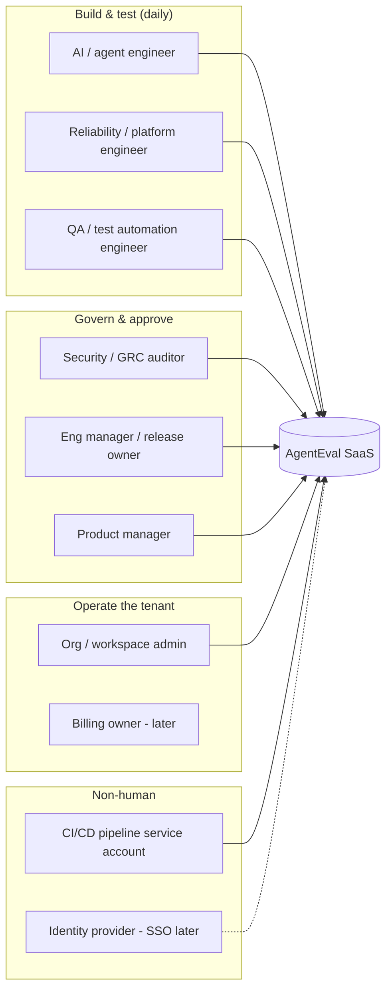
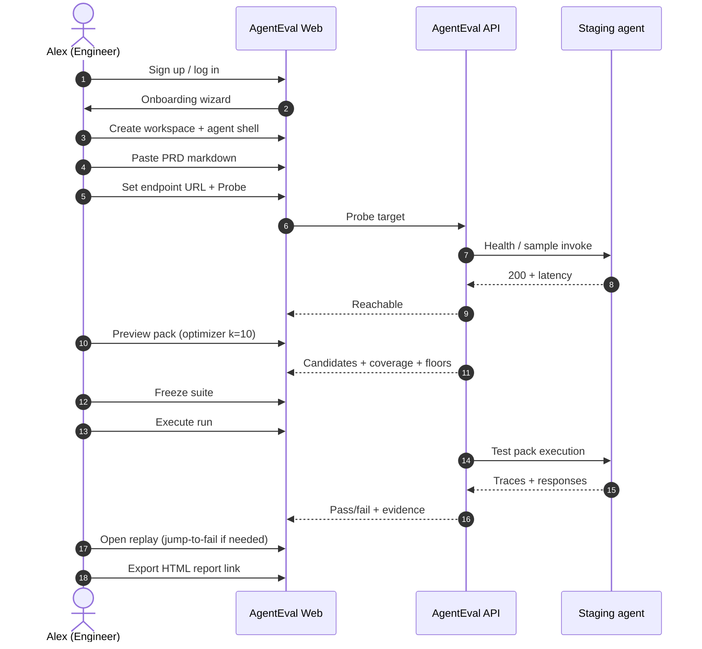
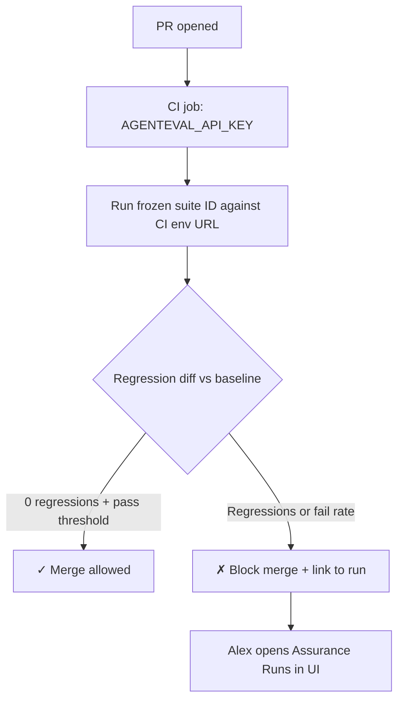
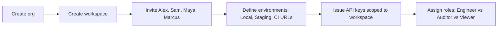

# Product Requirements Document (PRD) — AgentEval SaaS
## Pre-Release AI Agent Assurance & Evaluation Platform

> **Document Version:** 4.0.0  
> **Status:** Specification for UX generation & incremental build  
> **North Star:** [Black-Box Test Intelligence Pipeline](black-box-test-intelligence-pipeline.md) — requirements (+ optional URL) → optimized test pack → deterministic execution → coverage, gaps, and honest limitations ([DR-012](../engineering-ledger/decisions.md))  
> **Companion UX:** [ux-wireframes.md](ux-wireframes.md) (screen wireframes; personas & journeys authoritative in this PRD)  
> **Last updated:** 2026-09-20  

---

## Table of contents

1. [Executive summary](#1-executive-summary)
2. [Problem, vision & product boundaries](#2-problem-vision--product-boundaries)
3. [User ecosystem (who uses AgentEval)](#3-user-ecosystem-who-uses-agenteval)
4. [User personas](#4-user-personas)
5. [User journey maps](#5-user-journey-maps)
6. [SaaS platform: auth, orgs, onboarding](#6-saas-platform-auth-orgs-onboarding)
7. [Core product workflows](#7-core-product-workflows)
8. [Information architecture & navigation](#8-information-architecture--navigation)
9. [Functional requirements by epic](#9-functional-requirements-by-epic)
   - 9A. [Backbone requirements (domain-agnostic) — DRAFT](#9a-backbone-requirements-domain-agnostic--draft)
10. [Non-functional requirements](#10-non-functional-requirements)
11. [Out of scope & later phases](#11-out-of-scope--later-phases)
12. [Success metrics & release gates](#12-success-metrics--release-gates)
13. [Screen specifications (product console)](#13-screen-specifications-product-console)
14. [Design system & UX generator brief](#14-design-system--ux-generator-brief)

---

## 1. Executive summary

**AgentEval** is a **full SaaS** platform for teams that ship autonomous AI agents (tool-calling, multi-turn, side-effecting). It answers one question before production: *“Is this agent safe, correct, and non-regressive against our stated requirements?”*

Unlike chat-based “vibe checks” or opaque LLM-as-judge scores, AgentEval provides **pre-production software testing**: derive a minimal high-value test pack from requirements and an endpoint, execute against staging or CI, assert **observable evidence**, flag **UNVERIFIABLE** when proof is missing, and **gate releases** with frozen regression suites and baseline diffs.

**Primary commercial motion:** Individual engineer signs up → connects staging agent → pastes PRD → freezes suite → runs in UI or CI → shares HTML audit report with security and release stakeholders.

**Explicit non-goal for this PRD:** Live production monitoring, APM, or continuous in-prod agent telemetry (a future product line, not v1 SaaS).

---

## 2. Problem, vision & product boundaries

### 2.1 Problem

Teams deploy agents that can refund money, mutate databases, and call third-party APIs. Testing is manual, non-reproducible, and trusts agent self-reports. Regressions slip through prompt tweaks. Security reviewers lack exportable proof.

### 2.2 Vision

**Pre-release assurance console** + **API/CLI parity** so the same workflows work in the browser, in GitHub Actions, and locally.

### 2.3 Core tenets (product)

| # | Tenet | User-visible implication |
|---|--------|---------------------------|
| 1 | Pre-production testing, not prod APM | No “live agent dashboard” in v1; environments are *Local*, *Staging*, *CI* |
| 2 | Deterministic evidence vs self-report | Pass/fail from observable rules; `UNVERIFIABLE` when evidence is sealed |
| 3 | BYOA (zero agent code changes) | HTTP/OpenAPI/MCP/callable targets via configuration only |
| 4 | Requirements → suite intelligence | Paste/upload PRD; optimizer compresses candidate pool (set cover + mandatory floors) |
| 5 | Frozen regression suites | Freeze once; compare every run to baseline for release gating |
| 6 | Trajectory-first debugging | Multi-turn replay with jump-to-fail |

### 2.4 Dual delivery (SaaS + power users)

| Surface | Role |
|---------|------|
| **Web app** | Onboarding, studio, runs, replay, reports, team collaboration |
| **HTTP API** | Same Pydantic contracts as library ([DR-012](../engineering-ledger/decisions.md)) |
| **CLI** | Local dev, scripting, parity with API for CI runners |

---

## 3. User ecosystem (who uses AgentEval)

Before personas, map **every actor** that touches the product. Personas are composites of these roles.



### 3.1 Role summary

| Actor | Relationship to product | Typical frequency |
|-------|-------------------------|-------------------|
| **AI / agent engineer** | Authors agents; runs suites locally and in staging | Daily |
| **QA automation engineer** | Wires API tokens into CI; enforces pass gates on PRs | Daily (CI) |
| **Reliability / platform engineer** | Owns endpoints, secrets, environments; probes health | Weekly |
| **Security / compliance auditor** | Reviews mandatory floors, exports HTML/PDF evidence | Per release / audit |
| **Engineering manager / release owner** | Reads regression diff and pass rate; approves deploy | Per RC |
| **Product manager** | Supplies requirements text; validates capability coverage | Per feature |
| **Org / workspace admin** | Invites users, roles, API keys, environment URLs | Setup + ad hoc |
| **Executive / viewer** | Read-only run history and reports | Monthly |
| **CI service account** | `POST /v1/suites/run` with scoped token | Every PR |

---

## 4. User personas

Methodology: [ux-planner](../../.agents/skills/ux-planner/SKILL.md) — role, mental model, 5-second intent, fears, success threshold.

### Persona set v5 (active, 2026-09-25)

**Target market:** small companies (10–200 people) in regulated industries
deploying customer-facing agents. First domain pack: fintech; then insurance,
then health. Rationale: [idea one-pager §8](../ideas/agent-assurance-platform.md).

| ID | Role | Example | Goal | Fear | Success |
|----|------|---------|------|------|---------|
| U1 | **Agent / QA engineer** (hands-on, primary) | Engineer at a 30-person fintech who owns the support agent | Connect the agent and evidence sources once; run the frozen suite; find why a case failed | Tests pass on wording while the agent moved money wrongly | Every failure links to the requirement and the evidence that disproved it |
| U2 | **Compliance or product lead** (sign-off, primary) | Head of compliance or the PM for the agent | Approve requirements (including pack-mandated ones); sign a report an auditor or partner bank accepts | Signing off on something nobody actually tested | Report shows each requirement and control as proven, failing or `UNVERIFIABLE`, with nothing hidden |
| U3 | **CI bot** (service account) | GitHub Actions job | Run the frozen suite on each release candidate | Flaky gates | Blocks release when a mandatory requirement fails; same evidence gives same verdict |

**Mapping from v4:** Alex and Sam merge into U1. Maya, Marcus and Priya merge
into U2. CI Bot is U3. Jordan (workspace admin) and Riley (executive viewer)
are deferred until multi-user auth (E-AUTH / E-ORG). Pack authors are not a
persona: packs ship with AgentEval in v1.

The v4 matrix and journeys below are kept for reference; §5 journeys will be
rewritten against U1–U3.

### Persona matrix v4 (superseded, reference only)

```
┌──────────────────────────────────────────────────────────────────────────────────────────────────────────┐
│                                    AGENTEVAL SAAS PERSONA MATRIX (v4)                                     │
├─────────────┬────────────────────┬────────────────────┬────────────────────┬──────────────────────────────┤
│ ALEX CHEN   │ SAM ORTIZ          │ MAYA PATEL         │ MARCUS VANCE       │ JORDAN KIM                   │
│ AI Reliab.  │ QA Automation      │ Security Auditor   │ Release Gatekeeper │ Workspace Admin              │
│ Engineer    │ Engineer           │ (GRC / SecOps)     │ (Eng Lead)         │ (Platform / IT)              │
│ PRIMARY     │ PRIMARY (CI)       │ PRIMARY (audit)    │ SECONDARY          │ SECONDARY (setup)            │
├─────────────┼────────────────────┼────────────────────┼────────────────────┼──────────────────────────────┤
│ Build &     │ Gate merges on     │ Prove floors       │ 0 regressions vs   │ Invite team,                 │
│ debug agent │ frozen suite       │ before prod auth   │ baseline; sign-off │ environments, API keys       │
├─────────────┼────────────────────┼────────────────────┼────────────────────┼──────────────────────────────┤
│ PRIYA SHARMA│ RILEY NGUYEN       │ (Machine) CI BOT   │                    │                              │
│ Product Mgr │ Exec Viewer        │ GHA / GitLab       │                    │                              │
│ SECONDARY   │ TERTIARY           │ SERVICE ACCOUNT    │                    │                              │
└─────────────┴────────────────────┴────────────────────┴────────────────────┴──────────────────────────────┘
```

### P1 — Alex Chen · Senior AI Reliability Engineer (primary builder)

| Dimension | Detail |
|-----------|--------|
| **Role & mental model** | Ships refund/support/code agents. Thinks in Postman, VS Code, git branches. Wants “tests from my PRD,” not YAML archaeology. |
| **5-second intent** | “Where do I paste requirements, point at staging, and run a pack?” |
| **Fears** | Flaky LLM judges; 100-test CI bloat; false greens when the agent lies about tool use. |
| **Success threshold** | Preview → 8 tests cover capabilities → freeze → run → one failure → replay jump-to-fail → fix → green. |

### P2 — Sam Ortiz · QA Automation Engineer (CI primary)

| Dimension | Detail |
|-----------|--------|
| **Role & mental model** | Owns GitHub Actions / GitLab CI. Treats AgentEval as a **test job** like unit tests. |
| **5-second intent** | “What API call and secret do I add so PR #42 fails if regressions exist?” |
| **Fears** | Non-deterministic CI; missing docs for tokens; suite drift between dev and CI. |
| **Success threshold** | Docs copy-paste workflow; CI posts regression summary; merge blocked on fail. |

### P3 — Maya Patel · AI Safety & Security Auditor

| Dimension | Detail |
|-----------|--------|
| **Role & mental model** | Signs off before prod. Needs **proof**, not screenshots of chat. |
| **5-second intent** | “Are mandatory security floors green, and can I export evidence?” |
| **Fears** | Silent privilege escalation; injection bypass; unprovable “I checked role” claims. |
| **Success threshold** | Mandatory floors checklist ✓; HTML report with SHA256 suite hash; `UNVERIFIABLE` clearly labeled. |

### P4 — Marcus Vance · Engineering Lead / Release Gatekeeper

| Dimension | Detail |
|-----------|--------|
| **Role & mental model** | Approves release candidates; cares about trend and regressions, not test authoring. |
| **5-second intent** | “0 regressions vs last baseline and acceptable pass rate?” |
| **Fears** | Silent capability breakage; latency creep; no audit trail. |
| **Success threshold** | Regression banner green; one-click report link for leadership. |

### P5 — Jordan Kim · Workspace / Org Admin

| Dimension | Detail |
|-----------|--------|
| **Role & mental model** | Sets up tenant: users, roles, staging base URLs, API keys, (later) SSO. |
| **5-second intent** | “Invite my team and lock down who can freeze suites vs view-only.” |
| **Fears** | Shadow IT agents tested without governance; leaked API keys. |
| **Success threshold** | RBAC roles assigned; rotation-friendly API keys; audit log of freeze/run actions. |

### P6 — Priya Sharma · Product Manager

| Dimension | Detail |
|-----------|--------|
| **Role & mental model** | Owns requirements doc; validates that tests reflect user stories and policies ($100 refund cap). |
| **5-second intent** | “Does the generated pack cover the capabilities I wrote?” |
| **Fears** | Engineering-only jargon; no visibility into what was tested. |
| **Success threshold** | Capability coverage map matches PRD sections; can comment or flag missing capability (later). |

### P7 — Riley Nguyen · Executive / Viewer

| Dimension | Detail |
|-----------|--------|
| **Role & mental model** | Non-technical stakeholder; needs assurance summary. |
| **5-second intent** | “Did we test this agent, and what was the outcome?” |
| **Fears** | Overwhelming technical UI. |
| **Success threshold** | Read-only dashboard tile: pass rate, last run date, link to HTML report. |

### P8 — CI Bot · Service account (non-human persona)

| Dimension | Detail |
|-----------|--------|
| **Role** | Scoped token; runs frozen suite ID against `CI` environment URL from secrets. |
| **Success threshold** | Idempotent run API; JSON summary for PR comment integration (later). |

---

## 5. User journey maps

Stages: **Discover → Sign up → Onboard → Configure → Plan → Freeze → Run → Debug → Report → Gate → Admin**.

### 5.1 Journey A — Alex: first value in one session (happy path)



| Step | Alex thinks | Trust Δ |
|------|-------------|---------|
| Probe success | “It can reach my agent.” | ↑ |
| Set-cover stats | “8 tests, not 80.” | ↑ |
| UNVERIFIABLE on one case | “Honest product.” | ↑ |
| Replay | “I see the exact turn that broke.” | ↑ |

### 5.2 Journey B — Sam: CI gate on pull request



### 5.3 Journey C — Maya: security sign-off

1. Log in (Auditor role) → **Assurance Runs** (read + export).
2. Filter **Mandatory floors** / security-tagged tests.
3. Drill into failure or `UNVERIFIABLE` — inspect raw observation.
4. **Open standalone HTML report** → download for compliance folder.
5. Optional: attach report to ticket (manual v1; integration later).

### 5.4 Journey D — Marcus: release candidate review

1. Notification or link from Sam/Alex (Slack/email later).
2. Land on **Runs** with **Regression diff banner** vs `v1.1 baseline`.
3. Scan KPI strip (pass %, failures, unverifiable, latency).
4. Approve verbally / in Jira; no suite editing required.

### 5.5 Journey E — Jordan: tenant setup (day 0)



### 5.6 Journey F — Priya: requirements alignment

1. Upload or paste PRD in **Studio** (or Spec hub).
2. Review **capability extractor** output vs her doc sections.
3. Request engineer run **Thorough** pack before major launch (communication outside tool v1).

### 5.7 Cognitive walkthrough — signup landing (all personas)

| Look | Think | Do | Trust |
|------|-------|-----|-------|
| Headline: “Test agents before production” | “This is for engineers like me.” | Start free / Sign up | ↑ if social proof + clear BYOA |
| Purple CTA “Create workspace” | “Not another chat playground.” | Click | ↑ |
| Empty state in Studio | “What do I paste?” | Guided checklist: PRD → URL → Probe | ↑ or ↓ if vague |

---

## 6. SaaS platform: auth, orgs, onboarding

### 6.1 Tenancy model

```
Organization (billing entity - later)
└── Workspace (team boundary; secrets & suites)
    ├── Members + roles
    ├── Environments (Local | Staging | CI) → base URL + auth profile
    ├── Agents (logical target: id, description, linked endpoint per env)
    ├── Specifications (PRD uploads, OpenAPI)
    ├── Suites (draft preview | frozen)
    └── Runs (execution history, baselines, reports)
```

### 6.2 Authentication & account

| Requirement ID | Requirement | Priority |
|----------------|-------------|----------|
| AUTH-01 | Email + password sign up with verification email | P0 |
| AUTH-02 | Log in / log out / forgot password | P0 |
| AUTH-03 | OAuth: GitHub + Google | P1 |
| AUTH-04 | Session management (secure HTTP-only cookies or bearer for API) | P0 |
| AUTH-05 | SSO (SAML/OIDC) for enterprise | P2 (later) |

### 6.3 Authorization (RBAC)

| Role | Studio edit | Freeze suite | Execute run | View runs | Export report | Admin settings |
|------|-------------|--------------|-------------|-----------|---------------|----------------|
| **Owner** | ✓ | ✓ | ✓ | ✓ | ✓ | ✓ |
| **Engineer** | ✓ | ✓ | ✓ | ✓ | ✓ | — |
| **Auditor** | — | — | — (optional run in sandbox) | ✓ | ✓ | — |
| **Viewer** | — | — | — | ✓ | ✓ (read) | — |

### 6.4 Onboarding wizard (first login)

**Goal:** Time-to-first-run &lt; 15 minutes for Alex.

| Step | UI copy intent | Validation |
|------|----------------|------------|
| 1. Welcome | “Assure agents before production” | — |
| 2. Workspace name | Team or project name | Unique slug |
| 3. First agent | Agent display name + ID | Non-empty |
| 4. Requirements | Paste markdown or upload `.md` | Min length / parse ok |
| 5. Endpoint | Staging URL + optional auth header secret | **Probe** required to continue (soft skip with warning) |
| 6. First preview | Default optimizer **Balanced (10)** | Show candidate count |
| 7. CTA | **Freeze & run** or **Run preview once** | Lands on Assurance Runs |

**Empty states** after skip: persistent banner “Complete setup: probe endpoint.”

### 6.5 Settings surfaces

| Area | Contents |
|------|----------|
| **Profile** | Name, email, password, theme |
| **Workspace → Members** | Invite email, role, remove |
| **Workspace → API keys** | Create, revoke, last used, scopes (`run:read`, `suite:run`, `suite:write`) |
| **Workspace → Environments** | URL templates, default headers (secrets vault) |
| **Workspace → Agents** | Registry list, link specs, per-env endpoint overrides |
| **Org → Billing** | Placeholder “Coming soon” in v1 SaaS UI | P2 |

### 6.6 Notifications (v1 minimal)

- In-app: run completed, regression detected (banner on next visit).
- Email: invite to workspace; optional run failure (P1).

---

## 7. Core product workflows

Aligned with North Star pipeline: **Spec → Understand → Optimize → Freeze → Execute → Score → Coverage/Gaps → Report**.

| Workflow | Primary persona | Key outcome |
|----------|-----------------|-------------|
| **Author & optimize** | Alex, Priya | Preview pack + coverage + mandatory floors |
| **Freeze regression** | Alex, Sam | Immutable suite version for CI |
| **Execute assurance run** | Alex, Sam, CI Bot | Verdicts + traces |
| **Replay & debug** | Alex | Jump-to-fail trajectory |
| **Baseline & regression diff** | Marcus, Sam | vs previous green run |
| **Audit export** | Maya, Marcus | Standalone HTML (+ PDF certificate P1) |
| **Curate golden tests** | Alex | Promote failure trace to new case (P1) |

---

## 8. Information architecture & navigation

### 8.1 Authenticated app shell

```
AgentEval SaaS
├── Marketing (public): /, /pricing (later), /docs
├── Auth: /login, /signup, /forgot-password, /verify-email
├── Onboarding: /onboarding (wizard)
└── App (authenticated)
    ├── Home / Fleet overview (agents + last run status)     [P1]
    ├── Studio & Planner                                    [P0]
    ├── Assurance Runs                                      [P0]
    ├── Replay (deep link: /runs/:id/replay)                [P0]
    ├── Spec & uploads hub                                  [P1]
    ├── Reports library                                     [P1]
    └── Settings (profile, workspace, members, keys, envs)  [P0 members/keys P1 rest]
```

### 8.2 Mode switcher (in-app header)

Primary builder loop uses two modes (existing console pattern):

- **Studio & Planner** — spec, probe, optimizer, freeze  
- **Assurance Runs** — execute, regression diff, evidence, report  

Global context: **Workspace**, **Agent**, **Environment**, **Engine connection** status.

### 8.3 Fleet overview (home) — P1

Card per agent: last run pass %, regression badge, link to latest report. Serves Marcus, Riley, Jordan.

---

## 9. Functional requirements by epic

Priority: **P0** (MVP SaaS), **P1** (fast follow), **P2** (later).

### Epic E-ORG — Organization & workspace

| ID | Requirement | P |
|----|-------------|---|
| E-ORG-01 | User can create a workspace on first signup | P0 |
| E-ORG-02 | User can invite members by email with role | P0 |
| E-ORG-03 | User can list/remove members (Owner/Admin) | P0 |
| E-ORG-04 | Workspace isolates suites, runs, secrets | P0 |

### Epic E-AUTH — Authentication

| ID | Requirement | P |
|----|-------------|---|
| E-AUTH-01 | Sign up, login, logout | P0 |
| E-AUTH-02 | Email verification gate for new accounts | P0 |
| E-AUTH-03 | Password reset flow | P0 |
| E-AUTH-04 | OAuth GitHub/Google | P1 |

### Epic E-AGENT — Agent registry & environments

| ID | Requirement | P |
|----|-------------|---|
| E-AGENT-01 | CRUD agent records (id, name, description) | P0 |
| E-AGENT-02 | Per-environment endpoint URL + auth secret | P0 |
| E-AGENT-03 | **Probe** reachability with latency and status | P0 |
| E-AGENT-04 | Link agent to active specification | P0 |
| E-AGENT-05 | **Delete agent & cascade**: remove agent from workspace dropdown with confirmation modal, cascading deletion of frozen suites, run records, and execution evidence | P1 |

### Epic E-SPEC — Requirements & ingest

| ID | Requirement | P |
|----|-------------|---|
| E-SPEC-01 | Paste markdown PRD in studio | P0 |
| E-SPEC-02 | Upload `.md` / OpenAPI (yaml/json) | P1 |
| E-SPEC-03 | Display extracted capabilities with counts | P0 |
| E-SPEC-04 | Spec version history | P2 |

### Epic E-STUDIO — Preview & optimize

| ID | Requirement | P |
|----|-------------|---|
| E-STUDIO-01 | Preview pack without persisting (in-memory) | P0 |
| E-STUDIO-02 | Optimizer slider Fast 3 / Balanced 10 / Thorough 25 | P0 |
| E-STUDIO-03 | Show set-cover compression stats | P0 |
| E-STUDIO-04 | Mandatory floors checklist UI | P0 |
| E-STUDIO-05 | Test candidate inspector (prompt, invariant, metadata) | P0 |
| E-STUDIO-06 | Presets (refund bot, order swarm, code agent) | P1 |

### Epic E-SUITE — Freeze & sync

| ID | Requirement | P |
|----|-------------|---|
| E-SUITE-01 | Freeze suite to immutable version | P0 |
| E-SUITE-02 | List suite versions; CI references suite ID + version | P0 |
| E-SUITE-03 | Regenerate/sync when PRD changes ([DR-011](../engineering-ledger/decisions.md)) | P1 |

### Epic E-RUN — Execute & score

| ID | Requirement | P |
|----|-------------|---|
| E-RUN-01 | Execute frozen suite against selected environment | P0 |
| E-RUN-02 | Stream or poll run progress in UI | P0 |
| E-RUN-03 | Verdicts: PASS, FAIL, UNVERIFIABLE | P0 |
| E-RUN-04 | Execution evidence inspector (observation, response, rule) | P0 |
| E-RUN-05 | Set baseline run for regression comparisons | P0 |
| E-RUN-06 | Regression diff banner (new fail, fixed, unchanged) | P0 |

### Epic E-REPLAY — Trajectory debugger

| ID | Requirement | P |
|----|-------------|---|
| E-REPLAY-01 | Open replay from failed test row | P0 |
| E-REPLAY-02 | Step timeline + transport controls | P0 |
| E-REPLAY-03 | Jump-to-fail | P0 |
| E-REPLAY-04 | Thought / action / observation panes | P0 |
| E-REPLAY-05 | Environmental state diff when harness profile available | P1 |

### Epic E-REPORT — Reports & compliance

| ID | Requirement | P |
|----|-------------|---|
| E-REPORT-01 | Generate standalone HTML report per run | P0 |
| E-REPORT-02 | In-app modal viewer for HTML report | P0 |
| E-REPORT-03 | Shareable read-only link (tokenized) | P1 |
| E-REPORT-04 | PDF compliance certificate with suite hash | P1 |
| E-REPORT-05 | OpenTelemetry / OpenInference JSON export | P1 |

### Epic E-API — Developer & CI

| ID | Requirement | P |
|----|-------------|---|
| E-API-01 | REST parity: preview, init/freeze, run, get run, report | P0 |
| E-API-02 | Workspace-scoped API keys | P0 |
| E-API-03 | CLI uses same API optionally (`agenteval login`) | P1 |
| E-API-04 | Webhook on run complete | P2 |

### Epic E-AUDIT — Governance

| ID | Requirement | P |
|----|-------------|---|
| E-AUDIT-01 | Audit log: freeze, run, key created/revoked | P1 |
| E-AUDIT-02 | Export audit log CSV | P2 |

---

## 9A. Backbone requirements (domain-agnostic) — DRAFT

> **Status:** Approved for build (2026-09-27 design gate). Source for the domain
> model (`docs/design/domain-model.md`), ADR-005/006, and
> [requirements-traceability.md](requirements-traceability.md).
>
> **One sentence:** Given a specification and a way to reach an agent, the
> backbone turns requirements into a frozen, traceable test suite, runs it, and
> records a verdict per acceptance criterion backed by evidence, or
> `UNVERIFIABLE` when no evidence can prove it, for any domain supplied by a
> domain pack (for example finance or healthcare).
>
> **Rule:** requirements in this section never name a domain (refund, ticket,
> order, …) or an implementation (a database, a framework). Epics in §9 build on
> these. Status reflects code as of 2026-09-24: **Built**, **Partial**, **Not started**.

### Core (the backbone lives or dies by these)

1. Requirements are first-class, with stable IDs and acceptance criteria (FR-B-02, FR-B-03).
2. A frozen suite traces every test case to the criteria it checks (FR-B-07, FR-B-08).
3. Verdicts are recorded per criterion and cite evidence, with `UNVERIFIABLE` when proof is missing (FR-B-13, FR-B-14).

### Functional — backbone

| ID | Requirement | Refines | Status |
|----|-------------|---------|--------|
| **Specification & requirements** | | | |
| FR-B-01 | User can submit a specification as text; the system keeps each submitted version unchanged | E-SPEC-01, E-SPEC-04 | Partial — text + fingerprint stored per suite; no spec version entity |
| FR-B-02 | The system extracts requirements from a specification, each with a stable ID that survives edits to wording or headings | E-SPEC-03 | Partial — `requirement_id()` + SQLite `requirements.stable_id` on freeze |
| FR-B-03 | Each requirement has one or more acceptance criteria, each stating an observable condition and the kind of evidence that could prove it | — | Partial — default criterion on freeze; full lifecycle in [criterion-lifecycle.md](criterion-lifecycle.md) |
| FR-B-04 | User can review and correct extracted requirements and criteria before a suite is frozen | E-STUDIO-05 | Not started |
| FR-B-05 | When a new specification version is submitted, the system reports requirements added, changed and removed, by ID | E-SUITE-03 | Partial — diff by capability name |
| **Suite** | | | |
| FR-B-06 | The system generates a candidate pool of test cases from requirements and criteria, without running them | E-STUDIO-01 | Built (keyed by capability) |
| FR-B-07 | The system selects a test pack from the pool under a size budget, never dropping applicable mandatory categories | E-STUDIO-02..04 | Built |
| FR-B-08 | Every test case links to at least one acceptance criterion; every criterion shows which test cases cover it | — | Partial — `test_case_criteria` on freeze; API/report not exposed |
| FR-B-09 | User can freeze a pack as an immutable suite version; runs always reference a version | E-SUITE-01, E-SUITE-02 | Built |
| FR-B-10 | On spec change, user can derive a new suite version that removes tests only for removed requirement IDs, with a changelog | E-SUITE-03 | Partial — keyed by heading; renaming a heading can prune tests |
| **Execution** | | | |
| FR-B-11 | User can run a suite version against a target (an agent plus an environment), through any installed connector | E-RUN-01 | Partial — HTTP only; no environment entity used |
| FR-B-12 | The system records every interaction step of each test case in order, as it happened, and never reconstructs steps afterwards | E-REPLAY-02 | Built (`execution_steps`) |
| **Evidence & verdicts** | | | |
| FR-B-13 | Each test case execution collects evidence items, each recording its source and what it observed | E-RUN-04 | Partial — HTTP observations; state diff only in harness path |
| FR-B-14 | The system records a verdict (PASS, FAIL, UNVERIFIABLE) per acceptance criterion per execution, citing the evidence items used | E-RUN-03 | Not started — verdict per test case |
| FR-B-15 | A criterion is `UNVERIFIABLE` when no enabled pack or connected evidence source can produce the evidence kind it requires; it is never silently passed | E-RUN-03 | Partial |
| FR-B-16 | The same evidence always produces the same deterministic verdict; model-judged verdicts are labeled as such and never override `UNVERIFIABLE` | — | Partial — deterministic rules only; no judge tier |
| **Coverage & results** | | | |
| FR-B-17 | For each requirement, the system reports whether it is proven, failing, unverifiable or untested in a run | — | Partial — coverage per capability |
| FR-B-18 | User can compare a run against a chosen baseline run of the same suite version and see new failures, fixes and unchanged results | E-RUN-05, E-RUN-06 | Partial — compares to previous run only |
| FR-B-19 | User can produce a self-contained report of a run from stored results only | E-REPORT-01 | Built (contains domain wording) |
| FR-B-20 | Every backbone operation is available through the library and the HTTP API with the same behavior | E-API-01 | Partial |
| **Domain packs** | | | |
| FR-B-21 | User can enable one or more domain packs for a suite and set each pack's options; the selection is part of the suite version | E-STUDIO-06 | Not started — presets are UI examples, not packs |
| FR-B-22 | An enabled pack can add mandatory requirements; every requirement records its source (the specification, or a pack and its version) | E-STUDIO-04 | Partial — mandatory security categories exist as optimizer floors, not as requirements |
| FR-B-23 | The report groups results by the compliance controls declared by enabled packs, alongside results per requirement | E-REPORT-01 | Not started |

### Functional — pack and connector contract

Packs are written by the AgentEval maintainer in v1; customers enable them, they do not write them.

| ID | Requirement | Status |
|----|-------------|--------|
| FR-P-01 | A domain pack can be installed and used without changing any backbone file | Not started — domain logic in 15 backbone modules |
| FR-P-02 | A domain pack declares the acceptance-criterion kinds it can evaluate and the evidence kinds each one needs | Not started |
| FR-P-03 | A domain pack can contribute: options, domain terms for extraction, mandatory requirements, test scenarios, personas, synthetic test data, evidence interpreters, checks, and compliance mappings. Any subset is valid | Not started |
| FR-P-04 | A connector provides either agent transport (sending inputs, receiving outputs) or an evidence source, independently of any domain | Not started — adapters exist but are not registered as connectors |
| FR-P-05 | A suite version records which packs, connectors and versions produced it, so a run can be reproduced | Not started |
| FR-P-06 | The backbone lists installed packs and connectors and what each provides | Not started |

### Non-functional — backbone (assumptions, revisable)

| ID | Constraint | Target |
|----|------------|--------|
| NFR-B-01 | Deployment | Single node; one process for API, UI and runs; no external services required except the agent and an optional LLM provider |
| NFR-B-02 | Scale (small enterprise, assumed) | Up to 50 agents, 500 test cases per suite version, 10,000 test case executions per day |
| NFR-B-03 | Engine overhead | ≤ 200 ms per test case execution, excluding agent and LLM time |
| NFR-B-04 | Determinism | Re-scoring stored evidence yields identical deterministic verdicts, 100% of the time |
| NFR-B-05 | Durability | Frozen suite versions and completed runs are never modified or lost on process crash |
| NFR-B-06 | Offline | Everything except LLM-assisted generation and model-judged verdicts works without internet access |
| NFR-B-07 | Boundary enforcement | CI fails if backbone code imports a pack or contains domain vocabulary |

### Out of scope — backbone

- Authentication, workspaces and RBAC (covered by E-AUTH / E-ORG, built later on top of the backbone)
- Production trace ingestion and live monitoring (see §11, [DR-023](../engineering-ledger/decisions.md))
- Any domain-specific logic, presets or wording (belongs in packs)
- Customer-written packs (possible later; v1 packs ship with AgentEval)
- Multi-node execution and horizontal scaling

### Open questions

1. ~~Are acceptance criteria always extracted automatically, or can users author them directly?~~ **Resolved 2026-09-25:** extraction and packs propose criteria; the requirements owner can edit, add or remove them before freezing. Each criterion records its source (extracted, pack, or user). (FR-B-03, FR-B-04.)
2. ~~Is a target always one agent in one environment, or can one run compare several targets?~~ **Resolved 2026-09-25 ([ADR-005](../decisions/ADR-005-backbone-domain-packs-source-of-truth.md)):** one target per run; compare via baseline runs. (FR-B-11, FR-B-18.)
3. Do the scale assumptions in NFR-B-02 match your intended users?

---

## 10. Non-functional requirements

| Category | Target (v1 SaaS) |
|----------|------------------|
| **Availability** | 99.5% monthly (excludes customer agent downtime) |
| **Run UI feedback** | Run status updates ≤ 3s polling or SSE |
| **Probe timeout** | 10s default, configurable |
| **Data residency** | Single region (US) MVP; EU later |
| **Secrets** | Encrypted at rest; never echo in UI after save |
| **Multi-tenancy** | Hard workspace isolation on all queries |
| **Performance** | Studio preview ≤ 60s for k=25 (depends on LLM gateway) |
| **Accessibility** | WCAG 2.1 AA for core flows (signup, studio, runs table) |
| **Browser support** | Last 2 Chrome, Firefox, Safari, Edge |

---

## 11. Out of scope & later phases

| Item | Rationale |
|------|-----------|
| **Live production monitoring / APM** | Different product; pre-release only |
| **In-prod agent tracing ingestion** | Deferred |
| **Scenario YAML harness as default path** | Advanced/low priority ([DR-012](../engineering-ledger/decisions.md)) |
| **Built-in LLM hosting** | Customer brings agent endpoint |
| **Full billing & plans** | UI stub; manual early access |
| **Marketplace of test packs** | P2+ |
| **Real-time multi-user co-editing** | P2 |
| **Mobile native apps** | Web responsive only |

**Phase hint:** v1 SaaS = Auth + workspace + Studio + Runs + Replay + HTML report + API keys. v1.1 = Fleet home, OAuth, share links, golden curation. v2 = SSO, billing, webhooks.

---

## 12. Success metrics & release gates

### 12.1 Product metrics

| Metric | Definition |
|--------|------------|
| **TTFV** | Median time signup → first completed run |
| **Freeze rate** | % previews that become frozen suites within 7d |
| **CI adoption** | Workspaces with ≥1 API key running weekly |
| **Regression catch** | Runs with ≥1 regression detected before prod deploy (survey) |
| **Report export** | HTML report opens per run |

### 12.2 UX acceptance (per persona)

| Persona | Acceptance test |
|---------|-----------------|
| Alex | Complete onboarding wizard + green run without reading docs |
| Sam | CI job fails when injecting known regression |
| Maya | Export HTML; all mandatory floors visible |
| Marcus | Understand regression banner in &lt; 10s |
| Jordan | Invite user with Auditor role who cannot freeze |

---

## 13. Screen specifications (product console)

The following screens are the **authenticated product core** (P0). Visual wireframes: [ux-wireframes.md](ux-wireframes.md).

### 13.1 Global application header

- **Height:** 56px sticky; `bg-card/95`, backdrop blur, bottom border.
- **Left:** Logo + **AgentEval** + version pill (`Pre-Release`).
- **Center:** Segmented control — **Studio & Planner** | **Assurance Runs** (badge: frozen test count).
- **Right:** Agent selector, Environment badge (Local / Staging / CI), theme toggle, **Engine** connection pulse.

### 13.2 Studio & Test Planner (`/studio`)

**Left (specification):**

1. Presets quick-fill (P1).
2. Agent ID, target endpoint, **Probe** (200 OK + ms or Unreachable).
3. PRD / capabilities markdown editor with capability counter.
4. Optimizer ceiling slider k=3…25 (Fast / Balanced / Thorough).
5. Actions: **Preview pack** (outline), **Freeze suite** (primary purple).

**Right (inspector):**

1. Terminal chrome: view toggle Card vs Monaco, copy prompt.
2. Test candidate tabs `[01]`…`[k]`.
3. Badges: capability, persona tier, category, mandatory floor.
4. Sent prompt + invariant criterion + hypothesis rationale.
5. Bottom drawer: persona / failure / capability coverage bars; mandatory floors checklist; set-cover stats.

### 13.3 Assurance Runs (`/runs`)

1. **KPI strip:** Pass rate, pack tests, failures, unverifiable, avg latency (p95).
2. **Regression diff banner** vs baseline (0 regressions emerald; regressions rose + jump).
3. **Master-detail:** filterable table + execution evidence inspector (card + Monaco JSON).
4. Actions: **Execute run**, **Open standalone report**.

### 13.4 Trajectory debugger (`/runs/:id/replay`)

Playback, jump-to-fail, timeline ribbon, thought / action / observation (+ state diff P1).

### 13.5 Spec & uploads hub (`/uploads`) — P1

Drag-drop PRD/OpenAPI; spec library; promote failure to golden test.

### 13.6 Standalone HTML report

Allure-class offline HTML; filters; latency charts; drill-down. Modal in app + download.

### 13.7 Auth & onboarding screens (new — UX to generate)

| Screen | Must include |
|--------|----------------|
| **Marketing landing** | Value prop, CTA signup, BYOA diagram |
| **Sign up / Log in** | Email/password; OAuth P1; link to docs |
| **Verify email** | Resend, continue to onboarding |
| **Onboarding wizard** | Steps in §6.4 with progress indicator |
| **Invite accept** | Join workspace, role shown |
| **Settings → Members** | Table + invite modal |
| **Settings → API keys** | Create with scopes, one-time display |
| **Fleet home** | Agent cards, last run, P1 |

---

## 14. Design system & UX generator brief

### 14.1 Tokens

**Oklch grayscale + royal purple** — see [design-system/agenteval/MASTER.md](../../design-system/agenteval/MASTER.md).

| Token | Usage |
|-------|--------|
| `--background` | Canvas `#f8f9fa` / dark `#1a1b1e` |
| `--primary` | Royal purple CTAs (Freeze, Execute) |
| `pass` / `fail` / `warn` | Emerald / rose / amber verdicts |

Typography: **Inter** UI, **JetBrains Mono** code. Flat surfaces, minimal shadow.

### 14.2 Prompt for UX Pilot / Figma AI

> Design **AgentEval SaaS** — pre-release AI agent testing for engineering teams.  
>  
> **Personas:** Alex (engineer, daily), Sam (CI), Maya (auditor), Marcus (release), Jordan (admin).  
>  
> **Flows:** Sign up → onboarding wizard (PRD + endpoint probe) → Studio (2-column, optimizer, freeze) → Assurance Runs (KPIs, regression banner, table + evidence) → Replay (jump-to-fail) → HTML report. Include **Settings**: members, API keys, environments.  
>  
> **Style:** Oklch grayscale, royal purple primary, developer-dense but clean cards, Monaco for JSON, resizable split panes.  
>  
> **Do not design:** Production APM dashboards or live traffic monitors.

---

## Document history

| Version | Change |
|---------|--------|
| 3.0.0 | Pre-release console screen specs |
| 4.0.0 | Full SaaS: user ecosystem, 8 personas, journeys, auth/onboarding/RBAC, epics, NFR, scope |
| 4.1.0-draft | §9A backbone requirements (domain-agnostic) and plugin contract, with code status |
