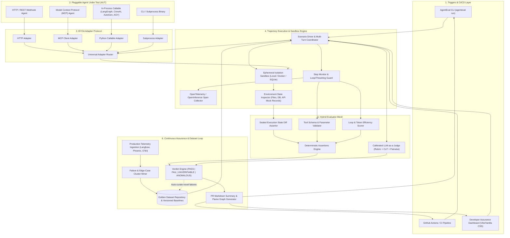
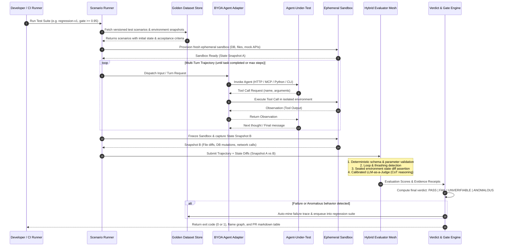

# AgentEval — System Architecture & Design Specification

> Produced via `system-design` and `architecture-diagram` skills.
> Aligned with `AGENTS.md` and `CONSTRAINTS.md`.

---

## 1. System Overview & Core Philosophy

AgentEval is a production-grade AI Agent Assurance & Evaluation platform. The platform is architected around **"Bring Your Own Agent" (BYOA)**, decoupling agent orchestration from assurance, telemetry, side-effect verification, and golden dataset curation.

```
Agent Developers write their Agent (LangGraph, CrewAI, AutoGen, REST, MCP)
                     │
                     ▼
           ┌───────────────────┐
           │ BYOA Adapter Hub  │  <-- Zero code changes required on target agent
           └─────────┬─────────┘
                     ▼
       ┌───────────────────────────┐
       │ Multi-Turn Trajectory Run │  <-- Isolated ephemeral environment
       └─────────────┬─────────────┘
                     ▼
       ┌───────────────────────────┐
       │ Deterministic State Diffs │  <-- Sealed execution proof (files, DB, APIs)
       └─────────────┬─────────────┘
                     ▼
       ┌───────────────────────────┐
       │ Hybrid Evaluator Mesh     │  <-- Schema tests + calibrated LLM judge
       └─────────────┬─────────────┘
                     ▼
       ┌───────────────────────────┐
       │ Verdict & CI/CD Gate      │  <-- PASS | FAIL | UNVERIFIABLE | ANOMALOUS
       └───────────────────────────┘
```

---

## 2. End-to-End System Architecture (Mermaid)



---

## 3. Execution Lifecycle Sequence Diagram (Mermaid)



---

## 4. Key Subsystem Responsibilities

### 1. BYOA Adapter Protocol (`agenteval/adapters/`)
* **Interface**: Standardized `AgentAdapter` abstract base class with `invoke()`, `reset()`, and `get_capabilities()`.
* **Implementations**:
  - `HTTPAdapter`: Connects to any REST/SSE/Webhook endpoint.
  - `MCPAdapter`: Connects to MCP servers over stdio or SSE.
  - `CallableAdapter`: Direct in-process execution of Python agents (LangGraph, CrewAI, AutoGen, AGY SDK).
  - `CLIAdapter`: Spawns and interacts with command-line agent binaries.

### 2. Trajectory & Step Monitor (`agenteval/trajectory/`)
* Records every atomic step: `Thought -> Tool Call -> Parameters -> Observation -> Latency -> Tokens`.
* **Guardrails**:
  - **Loop Detection**: Sliding-window hash checks on consecutive tool calls to immediately catch recursive infinite loops.
  - **Budget Enforcer**: Hard ceilings on max turns, max tokens, and wall-clock execution time.

### 3. Ephemeral Sandbox & Side-Effect Engine (`agenteval/sandbox/`)
* Never relies on an agent's self-generated claim.
* Injects mock services (mock Stripe, mock GitHub, mock SQL database, ephemeral directory).
* Captures a cryptographic `StateDiff`:
  $$\Delta S = \text{State}_{\text{post}} - \text{State}_{\text{pre}}$$
* Asserts whether mutations actually happened on disk, in database tables, or via outgoing network requests.

### 4. Hybrid Evaluator Mesh (`agenteval/evaluators/`)
* **Fast-Path (Deterministic, $0 Cost)**:
  - `ToolSchemaEvaluator`: Validates arguments against strict Pydantic/JSON schemas.
  - `StateDiffEvaluator`: Checks exact key-value assertions against $\Delta S$.
  - `StepEfficiencyEvaluator`: Evaluates path directness against baseline trajectory DAG.
* **Smart-Path (LLM-as-a-Judge)**:
  - Calibrated Chain-of-Thought scoring for subjective criteria (helpfulness, reasoning quality, safety, prompt compliance).
* **Verdict Taxonomy**:
  - `PASS`: Objective evidence matched, reasoning sound.
  - `FAIL`: Clear logic error, safety breach, or failed deterministic assertion.
  - `UNVERIFIABLE`: Agent claimed completion, but required environment evidence could not be sealed.
  - `ANOMALOUS`: Completed, but with extreme latency, high token thrashing, or suspicious detour.

### 5. Continuous Golden Dataset & Telemetry Loop (`agenteval/datasets/`)
* Ingests OpenTelemetry traces from staging or production.
* Clusters failure traces using embedding distance and error taxonomies.
* Automatically synthesizes minimal reproducible test scenarios with adversarial variations.

### 6. Real-Time & Interactive Replay Subsystem (`agenteval/replay/`)
* **Real-Time Live Streaming Playback**:
  - `LiveStreamHub`: Subscribes to execution events via SSE/WebSockets/in-process bus.
  - Renders live progress cards (thought stream, tool invocation, observation, state mutation) in terminal (`agenteval run --live`) and web viewer.
* **Interactive Time-Travel Debugger (`agenteval replay <run-id>`)**:
  - Step-by-step playback with visual timeline scrubber: step forward (`n`), backward (`p`), play/pause (`space`), speed control (0.5x, 1x, 2x, instant).
  - **Jump-to-Failure**: Instantly fast-forwards to the First Unrecoverable Step or failed assertion.
  - **State Snapshot Inspector**: Inspects pre/post file and DB state diffs at any point in the trajectory timeline.
  - **Side-by-Side Dual Replay**: Synchronously plays a passing golden run alongside a failing run, visually pinpointing the exact divergence point.
  - **Self-Contained Export**: Generates standalone `.html` replay players embeddable in GitHub PRs and CI reports.

### 7. Chaos Engineering & Fault Injection Subsystem (`agenteval/faults/`)
* **Tool Call Interceptor Proxy**: Sits transparently between the Agent Adapter and Environment tools.
* **Failure Injection Modes**:
  - **Network & Tool Faults**: Timeouts, HTTP 500, HTTP 429 with `Retry-After`, payload corruption, delayed returns.
  - **Idempotency & Retry Verification**: Asserts that tool retries safely supply idempotency keys and produce zero duplicate state mutations (`duplicate_side_effect_rate == 0`).
  - **Process Crash & Checkpoint Recovery**: Simulates runtime crashes (`SIGKILL` at Step $k$) and verifies agent state restoration from checkpoints without re-executing irreversible actions.
  - **Context Pressure & Degradation**: Injects history clutter and contradictory facts to measure critical fact retention.

---

## 5. Agent Requirement Ingestion & Archetype Metric Segregation

AgentEval does not apply a generic one-size-fits-all evaluation. It segregates requirements and metrics dynamically by **Agent Archetype**:

```
                       ┌─────────────────────────────────────────┐
                       │  Agent Contract & Requirements Plane 0  │
                       └────────────────────┬────────────────────┘
                                            │
               ┌────────────────────────────┼────────────────────────────┐
               ▼                            ▼                            ▼
      [ PRD / Jira / Spec ]        [ Protocol Introspection ]   [ AgentCard Manifest ]
      (Compiled via Spec Compiler) (MCP tools/list, OpenAPI)   (agenteval.manifest.yaml)
               │                            │                            │
               └────────────────────────────┼────────────────────────────┘
                                            ▼
                           ┌─────────────────────────────────┐
                           │   Jev-Powered Metric Router     │
                           │   (TypeSafe Archetype Classifier)│
                           └────────────────┬────────────────┘
                                            │
         ┌──────────────────┬───────────────┴───┬──────────────────┬─────────────────┐
         ▼                  ▼                   ▼                  ▼                 ▼
   [ Tool-Action ]        [ RAG ]            [ Code ]          [ Support ]       [ Swarm ]
   - StateDiff (ΔS)    - Faithfulness      - Patch Syntax    - HITL Approval  - Handoff Rate
   - Idempotency       - Context Precision - Unit Test Delta - PII Leakage    - Deadlock
   - Chaos Recovery    - Context Recall    - Static Analysis - Safety Rubrics - Redundancy
   - Loop Bounds       - Hallucination     - File Scope Guard- Tone & Policy  - Agent Bottlenecks
```

#### Archetype Selection & Metric Profiles:
1. **Tool-Action Agent**: Evaluated for multi-turn reasoning, schema conformity, loop bounding, idempotent retries, and cryptographic state diffs ($\Delta S$).
2. **RAG / Knowledge Agent**: Evaluated across the RAG Triad (Faithfulness, Context Precision, Context Recall) and Hallucination Index.
3. **Coding / Software Engineering Agent**: Evaluated for patch syntax, unit test execution delta, static analysis lints, and forbidden file modifications.
4. **Enterprise Customer Support Agent**: Evaluated for Human-in-the-loop (HITL) approval compliance before destructive actions, PII protection, and safety guardrails.
5. **Multi-Agent Swarm**: Evaluated for inter-agent handoff success, message overhead, communication graph efficiency, and agent redundancy.

---

## 6. Architectural Trade-offs & Justification

| Decision | What it Solves | What it Worsens | When to Change |
|---|---|---|---|
| **Deterministic State Diffs First, LLM Judge Second** | Eliminates LLM judge hallucination, zero-cost fast rejection, 100% test reproducibility. | Requires test authors to specify expected environment mutations. | For purely creative conversational agents with zero system side-effects. |
| **Local-First SQLite/DuckDB + OTel Exporters** | Zero cloud dependency, instant CLI startup, works offline and in CI. | Scalability limit on massive petabyte-scale distributed evaluation runs. | When running continuous million-agent evaluation pipelines in Kubernetes (switch to PostgreSQL + ClickHouse). |
| **Universal Adapter Protocol (BYOA)** | Works with any framework (LangGraph, CrewAI, AutoGen, REST, MCP) with zero code rewrites. | Requires adapter translation layer for custom proprietary schemas. | If an industry-wide single standard agent protocol completely dominates. |
| **Archetype Metric Segregation via Jev** | Prevents running irrelevant/expensive metrics (e.g. running RAG metrics on a bash agent). | Requires initial archetype classification step. | If an agent is a true general-purpose meta-agent that changes role mid-run. |
