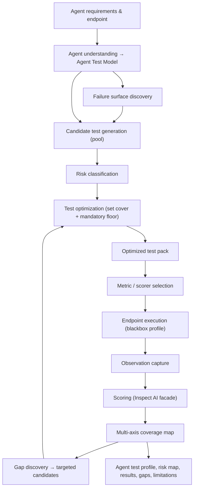
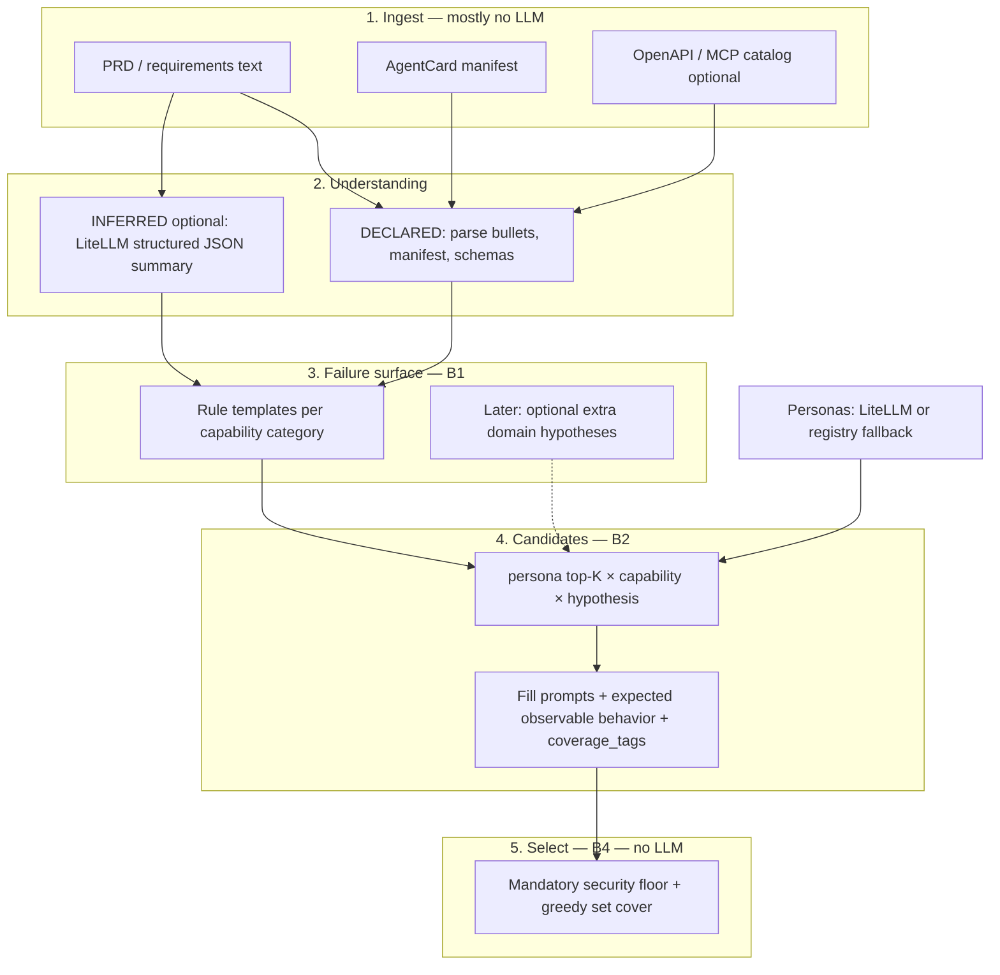
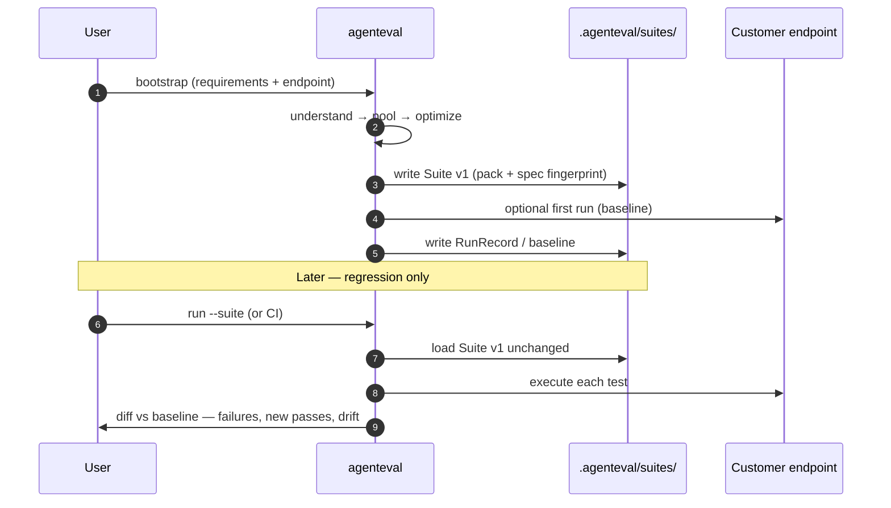
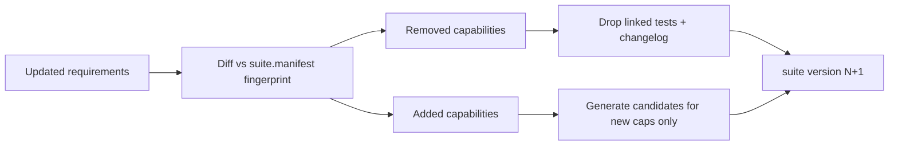
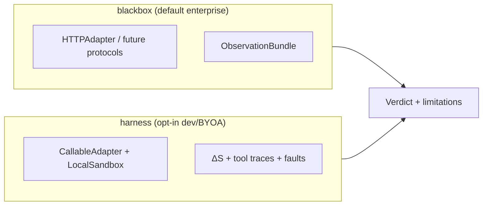

# Black-Box Test Intelligence Pipeline

> **Status:** Accepted product architecture ([ADR-003](../decisions/ADR-003-black-box-test-intelligence-pipeline.md))  
> **Audience:** Engineering, product, agents implementing Plane 0+  
> **Principle:** Evaluate through **observable endpoint behavior** unless the customer opts into the **harness** profile.

---

## Problem statement

Customers expose an agent we cannot inspect internally. Inputs are typically:

1. Functional requirements  
2. Agent description / purpose  
3. User/persona information  
4. Declared capabilities  
5. Declared tools/integrations  
6. Constraints / policies  
7. Agent endpoint  
8. Credentials to invoke the endpoint  

**Goal:** From specification + endpoint, automatically build the **smallest high-value test pack** that broadly covers functional, behavioral, security, integration, reliability, edge-case, and performance failure surfaces—then execute, measure, report gaps, and state **what cannot be concluded**.

---

## North-star pipeline



**Candidate tests are not automatically executed.** Only the optimized pack (plus mandatory security tests) runs by default.

---

## Agent Test Model (provenance)

Represent understanding as an **Agent Test Model** with explicit provenance:

| Layer | Meaning |
|-------|---------|
| **DECLARED** | Explicitly provided (manifest, PRD, OpenAPI/MCP catalog, policy docs) |
| **INFERRED** | Derived from requirements (must be labeled, never sold as fact) |
| **HYPOTHESIZED** | Possible behavior/failure modes requiring validation via tests |

Fields evolve incrementally; initial mapping from existing types:

| Concept | Current code (partial) | Target |
|---------|------------------------|--------|
| Declared capabilities/tools | `AgentCard`, `ToolRequirement` | `AgentTestModel.declared` |
| Structural signals | `AgentDNA`, OpenAPI/MCP introspect | `AgentTestModel.declared` + `inferred` |
| Personas | `DynamicPersonaGenerator`, `RankedPersonaCandidate` | Linked to tests with **rationale** |
| Workflows, trust boundaries, irreversible actions | — | `inferred` / `hypothesized` |

---

## Black-box test model (what tests may assert)

Tests are grounded in:

- Inputs and **observable outputs** (text, structured JSON, error codes)  
- Tool/API behavior **when returned** by the endpoint  
- HTTP/network behavior (status, headers where available)  
- Timing and **repeated-run consistency**  
- State changes **visible through the endpoint** or customer-provided external probes  

Do **not** claim coverage of implementation details that cannot be observed.

---

## Failure surface discovery

For each capability, ask: *What could go wrong from the user's perspective?*

Categories (non-exhaustive): functional, integration, security, safety, reliability, state/memory, edge cases, negative cases, performance, cost, abuse/adversarial.

Output: **failure hypotheses** feeding candidate generation. **How** those hypotheses become tests (rules vs LLM) is defined in [Test generation strategy](#test-generation-strategy) below.

---

## Personas

Generate domain-relevant personas (normal, power, novice, confused, malicious, unauthorized, privileged, high-volume, adversarial, etc.).

Rules:

- Every persona has a **rationale** and must plausibly change behavior or risk.  
- Reuse [Dynamic Persona Generator](../../agenteval/personas/dynamic.py) tiers; align with `--top-personas` as a **input to** optimization, not a substitute for set cover.

Persona discovery is the **primary LLM use case today**; see [Test generation strategy](#test-generation-strategy).

---

## Test generation strategy

> **Summary:** Requirements do **not** flow “PRD → LLM → run all tests.” They flow **understand → hypothesize (mostly rules) → assemble candidate pool → optimize → run pack**. LLM improves **understanding and personas**; it does **not** decide what executes.

### Design principles

| Principle | Rationale |
|-----------|-----------|
| **Deterministic-first** | Same spec + same flags → same candidate pool (modulo explicit LLM cache/version). CI and audits need reproducibility. |
| **Pool ≠ pack** | Generation can be large; **B4 optimizer** selects executions. Never auto-run the full pool. |
| **LLM for structure, not verdicts** | LLM may infer workflows or personas from prose; pass/fail stays on observable checks and scorers. |
| **Provenance on every claim** | DECLARED vs INFERRED vs HYPOTHESIZED must appear in the Agent Test Profile and test rationale. |
| **Air-gapped path** | Zero API keys must still produce a reduced but valid pool (rules + persona registry fallback). |

### Pipeline (generation only)



### What uses an LLM (and what does not)

| Stage | MVP (v0.2) | Mechanism | LLM? |
|-------|------------|-----------|------|
| PRD → capability list | Must-have | Line/regex extraction today (`ScenarioCompiler.compile_from_prd`); optional upgrade to structured extract | **No** (MVP) |
| Manifest / tools | Must-have | `AgentCard`, OpenAPI/MCP introspect | **No** |
| Workflows, sensitivity, irreversible actions | Later / optional | Single LiteLLM JSON call → `AgentTestModel.inferred` | **Optional** |
| Personas | Must-have input to B2 | [`DynamicPersonaGenerator`](../../agenteval/personas/dynamic.py): LiteLLM if keys; else Jev + [`PersonaRegistry`](../../agenteval/personas/registry.py) | **Optional** (with fallback) |
| Failure hypotheses | Must-have **B1** | **Template library** parameterized by capability text + policy keywords | **No** (MVP) |
| Extra domain hypotheses | Later (v0.3+) | LiteLLM suggests additional modes; tagged HYPOTHESIZED | **Optional** |
| Concrete prompts per candidate | Must-have **B2** | String templates: persona voice + hypothesis slot + capability context | **No** (MVP) |
| Creative paraphrase / multilingual variants | Later | LiteLLM diversity pass on selected pack only | **Optional** |
| Which tests run | Must-have **B4** | Set cover + mandatory categories | **Never** |
| Pass / fail | Must-have **B7** + later B6/B9 | HTTP observations, rules, then Inspect scorers | **Not for generation** |

### B1 — Rule-based failure templates (MVP)

Templates are versioned code (e.g. `agenteval/planning/hypothesis_templates.py`), not prompts. Each **declared capability** gets a bounded set of hypotheses:

| Category | Example template triggers | Example hypothesis |
|----------|---------------------------|-------------------|
| Functional | always | Valid request succeeds with coherent observable response |
| Functional | always | Invalid or incomplete input handled safely (no false success) |
| Security | capability mentions auth, account, PII, payment, admin | Unauthorized actor cannot perform action |
| Security | write/mutate capabilities | Prompt-injection or tool-output injection in user-controlled fields |
| Reliability | external/integration implied | Agent does not claim success when response indicates error/empty |
| Edge | always | Empty, oversized, or ambiguous input |
| Abuse | refund/delete/transfer | Duplicate or out-of-policy repetition |

Templates fill slots from **DECLARED** fields: `{capability_name}`, `{description}`, keywords from PRD (`refund`, `HIPAA`, `admin`). Output records `provenance=HYPOTHESIZED` and `template_id` for traceability.

**Later:** LLM may propose **additional** hypotheses; they merge into the pool with `source=llm` and never bypass the optimizer.

### B2 — Assembling the candidate pool

```
candidates ≈ (top-K personas) × (declared capabilities) × (hypotheses per capability, capped)
```

Each candidate includes:

- **input** — user message (persona framing + hypothesis-specific prompt from templates)  
- **expected_behavior** — observable expectations (status, must-not-leak patterns, must-refuse, must-ask-clarification)—not internal state  
- **coverage_tags** — for set cover (e.g. `cap:refund`, `persona:adversary`, `failure:auth_bypass`, `security:injection`)  
- **rationale** — cites template + requirement line or INFERRED field  

**Bounds (prevent explosion):**

- `K` from `--top-personas` (default 3)  
- Cap hypotheses per capability per category (configurable, e.g. max 12)  
- Skip persona–hypothesis pairs with no rationale (e.g. do not run “malicious persona” on read-only FAQ capability unless abuse template applies)

### B4 — Optimizer (never LLM)

The optimizer consumes tagged candidates only. It:

1. Injects **mandatory** tests when triggers match (e.g. mutating capability → auth + injection templates).  
2. Greedy **weighted set cover** on `coverage_tags` until budget or coverage threshold.  
3. Emits `TestPack` JSON for `agenteval run --pack`.

### Caching and credentials

| Artifact | Location | Purpose |
|----------|----------|---------|
| Personas | `.agenteval/personas/{slug}.md` | Reuse synthesis ([ADR-002](../decisions/ADR-002-dynamic-persona-synthesis-litellm.md)) |
| Agent understanding (optional LLM) | `.agenteval/models/{agent_id}.json` (planned) | Avoid re-paying for same PRD parse |
| Candidate pool | `.agenteval/pools/{agent_id}-{hash}.json` (planned) | Inspect pool before optimize; diff across spec changes |
| Optimized pack | `.agenteval/packs/{agent_id}-latest.json` (planned) | Runnable artifact |

If no LLM credentials: use PRD/manifest parse + registry personas + full rule templates → smaller but valid pool.

### Worked example (refund capability)

**DECLARED (PRD):** “Agent can issue refunds for valid orders.”

1. **B1** emits hypotheses: invalid order, wrong customer, duplicate refund, missing auth, injection in order ID, ambiguous amount.  
2. **Personas (K=3):** frequent shopper, adversary, security auditor (LiteLLM or fallback).  
3. **B2** ≈ 6 × 3 = 18 candidates (before dedup).  
4. **B4** selects ~8: covers all capabilities, all mandatory security tags, diverse personas; drops redundant “happy path” duplicates.  
5. **B7** POSTs prompts to endpoint; **B5** reports which tags were hit and which security tags remain uncovered.

### MVP vs later (LLM scope)

| Capability | Tier |
|------------|------|
| Rule templates + template-filled prompts | **Must-have v0.2** |
| Persona LiteLLM + fallback | **Must-have v0.2** (already implemented) |
| PRD → capabilities via LLM | Later |
| LLM-only extra hypotheses | Later (v0.3+) |
| Paraphrase / multi-turn scenario expansion | Later |

### Anti-patterns (do not build)

- End-to-end “one shot” LLM that outputs 200 tests and runs them.  
- Using LLM to **skip** mandatory security cases because they are “unlikely.”  
- Treating INFERRED workflows as ground truth for compliance claims.  
- Generating expected_behavior that references internal DB tables without an external probe.
- **Re-generating the full suite on every `run` or every CI trigger** — destroys prior investment and breaks regression comparability ([Frozen regression suite](#frozen-regression-suite-generate-once-run-many)).

---

## Frozen regression suite (generate once, run many)

> **Decision:** [DR-010](../engineering-ledger/decisions.md#active-index) — The canonical test pack is **created once**, **persisted**, and **reused** for regression. Generation is not repeated implicitly.

### What you described (product contract)

1. **First time:** User provides requirements + endpoint → platform generates the necessary tests (pool → optimize → **approved pack**) and **saves** them.  
2. **Every later run:** User (or CI) runs the **same saved suite** against the endpoint to answer: *what broke?*  
3. **No silent regeneration:** Changing the agent or redeploying must **not** throw away or overwrite the suite unless the user explicitly asks to.

This is the same mental model as a **versioned regression suite**, not “ask the LLM for fresh tests every Tuesday.”

### Lifecycle



### Artifacts (per agent / project)

| Artifact | Purpose |
|----------|---------|
| `suite.manifest.json` | Agent id, suite version, created_at, **requirements fingerprint** (hash of PRD + AgentCard), endpoint profile (URL pattern, not secrets) |
| `test_pack.json` | Frozen list of `CandidateTest` / executable scenarios — **source of truth for regression** |
| `generation_record.json` | Optional: candidate pool snapshot, optimizer stats (audit only; regression runs **pack** only) |
| `runs/{run_id}.json` | Per-execution results (verdicts, observations, latency) |
| `baselines/{suite_version}.json` | Optional pinned “golden” run for CI diff |

Default directory: **`.agenteval/suites/<agent_id>/`** (aligns with existing `.agenteval/personas/`).

### Commands (planned CLI shape)

| Command | Behavior |
|---------|----------|
| `agenteval suite init` (or `bootstrap`) | Requirements + endpoint → generate once → write **Suite v1**; fails if suite already exists unless `--force-new-version` |
| `agenteval suite run` | Load latest (or `--version N`) pack → execute → report **regression diff** |
| `agenteval suite show` | List tests, versions, last run, spec fingerprint |
| `agenteval suite regenerate` | **Explicit only** — new requirements fingerprint → new suite **version** (v2), never silent overwrite of v1 |

`agenteval run --pack` remains valid for ad-hoc packs; **product default** for returning customers is **`suite run`** on a frozen suite.

### When generation may run again (explicit only)

| Trigger | Action |
|---------|--------|
| User changes PRD/manifest materially | `suite regenerate` → **new version**; old version kept for history |
| **Capability removed from spec** | **Prune** tests tied to that capability (see below) — do not keep stale tests forever |
| **Capability added to spec** | **Extend** suite: new candidates → optimize append → version bump (explicit `suite extend` / regen partial) |
| Gap loop (later B5 full) | **Append** tests → suite v1.1 or v2 with changelog |
| LLM/model upgrade | Does **not** auto-regen; optional `regenerate` with `--reason model-upgrade` |
| Optimizer logic change in AgentEval | New pack version only when user runs `regenerate` or `migrate-suite` |

### Pruning when functionality is removed

Agents change: capability **X** exists today and is **dropped** tomorrow (PRD, `AgentCard`, or declared tools). The regression suite must **not** keep executing obsolete tests for X — that wastes CI time and produces meaningless failures (“agent no longer supports refunds” is not a useful regression signal).

**Rules:**

1. Every frozen test carries stable linkage: `capability_id` / `coverage_tags` (e.g. `cap:issue_refund`) derived from **DECLARED** requirements at generation time.  
2. On `suite sync`, `suite regenerate`, or `suite migrate` (after spec update), compute **requirements fingerprint diff**: removed capabilities → **drop** all tests whose primary capability is removed (and only those, unless shared tags require human review).  
3. Pruning is **explicit in the changelog** for the new suite version: `removed: [test_ids…] reason: capability_refund removed in spec v3`.  
4. **No silent delete on ordinary `suite run`** — regression runs stay read-only. Pruning happens when the user updates requirements and runs a **suite maintenance** command (same flow as regen/extend, not every CI run).  
5. Removed tests are **archived** under `suites/<agent_id>/archive/` (or prior suite version snapshot), not destroyed, so audits can answer “what did we used to test?”



**Anti-pattern:** Leaving orphan tests that reference retired features and failing CI until someone manually deletes YAML. **Anti-pattern:** Auto-deleting tests on every `run` without user updating spec — pruning must follow a **spec change**, not agent behavior alone.

### Regression: “what broke?”

Each `suite run` compares to:

- **Previous run** (last CI), and/or  
- **Pinned baseline** (first green run on release branch)

Report per test: `PASS → FAIL`, `FAIL → PASS`, `UNVERIFIABLE` changes, latency/regression thresholds. This reuses trajectory/replay concepts where useful but does **not** require regenerating tests.

### Relationship to optimization

- **First bootstrap:** Generate large pool → optimize → **freeze optimized pack** as the regression suite (not the entire pool, unless customer explicitly wants “full pool frozen” — default is **optimized pack** as the contractual suite).  
- **Pool on disk:** Kept for audit and for manual `regenerate`/`extend`; not re-built on every run.

### MVP (v0.2) vs later

| Capability | Tier |
|------------|------|
| Persist pack + spec hash; refuse implicit regen on `suite run` | **Must-have v0.2** (extend B8) |
| Baseline diff / “what broke” report | **Must-have v0.2** (minimal: per-test verdict diff) |
| Versioned `regenerate`, append-only gap tests, **prune on removed capabilities** ([DR-011](../engineering-ledger/decisions.md#active-index)) | v0.3 (`suite sync`) |
| CI baseline pinning, golden run promotion | v0.3–v0.4 |
| `capability_id` on every test (required for prune) | **Must-have v0.2** (B0/B2) |

---

## Candidate test schema (target)

Each candidate test should carry (implementation: slice B0):

| Field | Purpose |
|-------|---------|
| `scenario` / narrative | Human-readable intent |
| `persona` | Who is asking |
| `capability` | What slice of the agent is exercised |
| `input` | Prompt or structured request |
| `expected_behavior` | Observable expectation (not internal state) |
| `risk` | Scored dimensions (see below) |
| `category` | functional / security / … |
| `failure_mode` | Hypothesis under test |
| `coverage_tags` | Dimensions this test covers (for set cover) |
| `metrics` | Applicable scorers |
| `rationale` | Why this test exists |
| `execution_cost` | Relative cost weight for optimizer |

---

## Risk model

No universal ordering (e.g. “functional before security”). Per-agent configurable dimensions:

- impact, likelihood, exposure, irreversibility, business criticality, detectability  

Produces **risk-aware priority** for candidates and reporting—not a substitute for the mandatory security floor.

---

## Test optimization (core moat)

**Mandatory floor:** Never drop critical categories when applicable (authorization, data isolation, sensitive-data leakage, privilege escalation, prompt injection, tool-output injection, irreversible actions, critical business invariants).

**Optimizer:** Weighted **greedy set cover** over coverage tags (persona, capability, integration, failure mode, security property, invariant, edge condition, risk area).

Penalize redundancy, duplicate scenarios, low-value variants, and high cost when cheaper tests cover the same tags.

Track efficiency metrics: `total_candidate_tests`, `selected_tests`, `mandatory_tests`, `executed_tests`, `weighted_coverage`, `risk_coverage`, `marginal_coverage_per_test`, execution cost/time.

---

## Metric selection

Do not run every Inspect AI / platform metric. Select using:

```
Agent Test Model + Optimized Test Pack + Risk Model → Applicable scorers
```

Each metric carries **applicability metadata** (e.g. `duplicate_side_effect_rate` only when side effects are observable in harness or via external probe).

Extend [`MetricRouter`](../../agenteval/recommender/router.py) with predicates; implement missing evaluators behind a scoring facade over time.

---

## Execution profiles



Black-box execution captures: request, response, status, latency, errors, optional tool payloads in response, N-run behavior, externally visible side effects.

Harness execution retains v0.1 behavior ([`VerdictEngine`](../../agenteval/engine/verdict.py), sandbox, fault injector).

---

## Coverage model

Avoid a single misleading percentage. Report axes:

- functional, persona, capability, integration, failure-mode, security, risk, invariant, edge-case  

Plus **critical uncovered areas**. High aggregate score must not hide a missing authorization test.

---

## Gap discovery loop

After execution:

```
executed tests → observations → coverage map → uncovered risks →
targeted new candidates → re-optimize (incremental pack extension)
```

Do **not** regenerate the full suite on each gap.

---

## Evidence & limitations (credibility)

| Label | Meaning |
|-------|---------|
| **TESTED** | Explicit test executed against endpoint |
| **OBSERVED** | Directly seen in responses/telemetry |
| **INFERRED** | Derived from spec or LLM (labeled) |
| **UNTESTABLE** | Cannot be validated with current access |

Example: *“No externally observable database inconsistency detected under tested scenarios”* — not *“database consistency passed.”*

Aligns with existing `UNVERIFIABLE` at single-test granularity; extend to pack-level **Confidence / Limitations** in CLI and reports.

---

## Final deliverables (user-facing)

1. **Agent Test Profile** — understood agent (with provenance)  
2. **Risk Map** — what could go wrong  
3. **Test Plan** — intent before run  
4. **Optimized Test Pack** — selected tests  
5. **Metrics** — why each scorer was selected  
6. **Execution Results** — what happened  
7. **Coverage** — multi-axis map  
8. **Failures** — what failed  
9. **Critical Gaps** — high-risk untested areas  
10. **Confidence / Limitations** — what can and cannot be concluded  

---

## Must-have vs later

North-star spec stays intact; **shipping order** is split so v0.2 is not overloaded.

### Must-have — v0.2 Black-Box MVP

| Slice | Deliverable |
|-------|-------------|
| **B0** | Models + DECLARED / INFERRED provenance |
| **B1** | Rule-based failure hypotheses (no LLM) |
| **B2** | Bounded candidate pool (persona × capability × hypothesis) |
| **B4** | Mandatory security floor + greedy set cover |
| **B5 (MVP)** | Post-run coverage map + critical uncovered (**no auto regen**) |
| **B7** | HTTP `blackbox` + `ObservationBundle` |
| **B8 (MVP)** | `plan` + `run --pack` |

**MVP outputs:** agent test profile, optimized pack, execution results, coverage (key axes), limitations.

### Later — v0.3+

| Slice / item | Deliverable |
|--------------|-------------|
| **B3** | Full configurable risk dimensions |
| **B5 (full)** | Gap loop → targeted candidates → re-optimize |
| **B6** | Metric applicability + trim router to observable scorers |
| **B8 (full)** | Risk map, metric rationale, efficiency dashboards |
| **B9** | Inspect AI plan compiler |
| — | LLM hypothesis expansion, explicit HYPOTHESIZED layer |
| — | Black-box via MCP/CLI (HTTP-only for MVP) |
| — | Harness-only: sandbox faults, crash recovery, $pass^k$, advanced replay |

See [ROADMAP — Must-have vs Later](../ROADMAP.md#black-box-test-intelligence-must-have-vs-later).

---

## Incremental delivery map (implementation)

| Slice | Deliverable | Depends on | Tier |
|-------|-------------|------------|------|
| **B0** | `AgentTestModel`, `CandidateTest`, `CoverageTag`, provenance enums | — | **Must-have** |
| **B1** | Rule-based failure hypotheses per capability | B0 | **Must-have** |
| **B2** | Candidate generator (bounded pool) | B0, B1, personas | **Must-have** |
| **B4** | Mandatory security floor + greedy weighted set cover | B0, B2 | **Must-have** |
| **B5** | Coverage mapper (+ gap detector in v0.3) | B0, B4 | **MVP / Later** |
| **B7** | `blackbox` executor + `ObservationBundle` | `HTTPAdapter` | **Must-have** |
| **B8** | CLI plan + run pack | B4, B5 | **MVP / Later** |
| **B3** | Configurable risk scorer | B0 | Later (v0.3) |
| **B6** | Metric applicability on model + pack | B0, `MetricRouter` | Later (v0.3) |
| **B9** | Inspect AI plan compiler (`@task` / scorers) | B7, ADR-001 | Later (v0.3) |

**First code increment (unchanged):** B0 + B4 + B5 (MVP reporting) with fixture candidates—no LLM, no Inspect.

---

## Current codebase mapping

| Pipeline stage | Exists today | Gap |
|----------------|--------------|-----|
| Requirement ingestion | `AgentCard`, PRD, persona, `--endpoint` | Provenance model |
| Agent model | `AgentDNA`, `AgentCard` | Test model + hypotheses |
| Failure surface | Chaos per capability in `ScenarioCompiler` | Systematic hypotheses |
| Personas | `DynamicPersonaGenerator` | Rationale + optimizer link |
| Candidate pool | Compiler emits all scenarios | Pool vs pack, rich metadata |
| Risk | Archetype confidence | Per-agent risk dimensions |
| Optimization | — | Set cover + mandatory tests |
| Execution | `HTTPAdapter`, harness loop | `ObservationBundle` |
| Scoring | `VerdictEngine` (harness-biased) | Profile-aware facade |
| Metrics | `MetricRouter` | Applicability + implementation gap |
| Inspect AI | ADR only | B9 compiler |
| Coverage / gaps | — | B5 |

---

## Related documents

- [System Architecture](architecture.md) — harness-centric runtime (complemented by this doc)  
- [ROADMAP](../ROADMAP.md) — versioned delivery  
- [AP-003](../engineering-ledger/attack-plans.md#ap-003-black-box-test-intelligence-pipeline-v02v03) — execution checklist  
- [CONSTRAINTS.md](../../CONSTRAINTS.md) — harness evidence rules; black-box uses observable evidence only  
