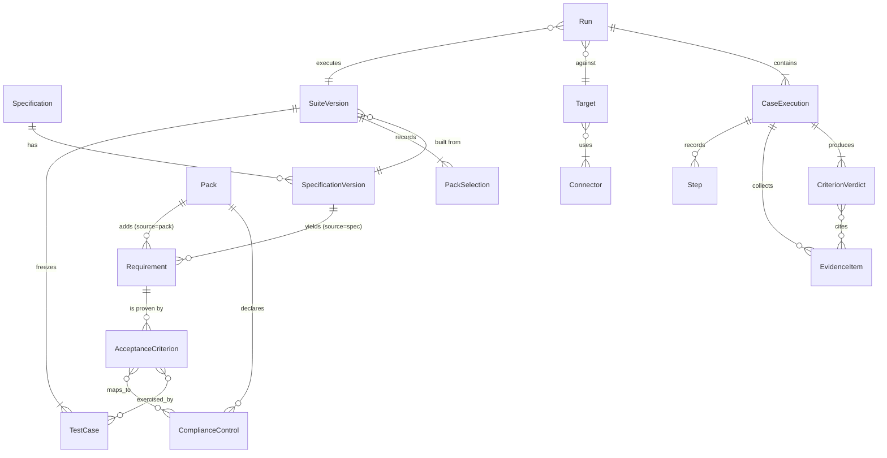

# AgentEval domain model

> **Status:** Accepted (2026-09-25, design gate 2026-09-27). Entry point:
> [DESIGN_INDEX.md](DESIGN_INDEX.md). Persistence:
> [persistence-schema.md](persistence-schema.md). Criteria:
> [criterion-lifecycle.md](criterion-lifecycle.md). Traceability:
> [requirements-traceability.md](requirements-traceability.md).
> **Traces to:** PRD §9A (FR-B-01..23, FR-P-01..06), personas U1–U3 (PRD §4 v5).
> **Rule:** no entity here names a domain. Domain meaning arrives only through
> packs.

## 1. Entities

| Entity | What it is | Owner (persona) | Mutable? |
|--------|------------|-----------------|----------|
| **Specification** | A named product spec (e.g. "Support agent PRD") | U2 | Yes (new versions) |
| **SpecificationVersion** | Immutable snapshot of the spec text, hashed | U2 | No |
| **Requirement** | One testable statement, with a stable ID that survives heading renames. Source: `spec` or `pack` | U2 | Until suite freeze |
| **AcceptanceCriterion** | A checkable condition for a requirement, with the evidence kind it needs. Source: `extracted`, `pack` or `user` | U2 | Until suite freeze |
| **Pack** | Installed domain pack (name, version, the slots it fills) | Maintainer | No (per version) |
| **PackSelection** | Packs enabled for a suite, with their options | U1 / U2 | Until suite freeze |
| **ComplianceControl** | A control declared by a pack (e.g. a regulation clause) that criteria map to | Pack | No |
| **Connector** | Installed transport (HTTP, MCP) or evidence source (DB diff, audit log, traces) | U1 | Config only |
| **Target** | An agent reachable through a transport connector in one environment, plus its evidence sources | U1 | Config only |
| **TestCase** | A scenario (inputs, persona, test data) that exercises one or more criteria | System (proposed), U1/U2 (reviewed) | Until suite freeze |
| **SuiteVersion** | Frozen set of test cases + criteria + pack and connector versions | U2 approves | **No** |
| **Run** | One execution of a suite version against a target | U1 / U3 | Append-only until complete |
| **CaseExecution** | One test case executed once within a run | System | Append-only |
| **Step** | One observed action inside an execution (message, tool call, HTTP exchange) | System | No |
| **EvidenceItem** | Sealed, hashed observation from a connector (response, DB diff row, audit event) | System | No |
| **CriterionVerdict** | PASS / FAIL / UNVERIFIABLE for one criterion in one execution, citing evidence items; labeled `deterministic` or `model_judged` | System | No |
| **Report** | Rendering of a run from stored verdicts only | System | No (regenerable) |

## 2. Relationships



## 3. Lifecycles

```text
Requirement/Criterion:  proposed ──► approved ──► frozen (inside a SuiteVersion)
                             └────► rejected
SuiteVersion:           draft ──► frozen            (frozen is terminal; changes = new version)
Run:                    queued ──► running ──► completed | failed | cancelled
CriterionVerdict:       written once; never updated (re-score = new verdict row, same evidence)
```

## 4. Invariants

1. A frozen SuiteVersion never changes; any edit creates a new version (FR-B-08, NFR-B-05).
2. Requirement IDs are stable across spec versions when the statement is unchanged, regardless of heading text (FR-B-02).
3. Every Requirement and AcceptanceCriterion records its source; pack-sourced ones record pack name and version (FR-B-22).
4. A CriterionVerdict of PASS or FAIL must cite at least one EvidenceItem. No evidence ⇒ `UNVERIFIABLE` (FR-B-15).
5. A `model_judged` verdict never overrides `UNVERIFIABLE` (FR-B-16).
6. Re-scoring the same evidence with the same criterion yields the same deterministic verdict (NFR-B-04).
7. A Run references exactly one SuiteVersion and one Target (ADR-005).
8. Backbone entities contain no domain vocabulary; domain meaning lives in Pack, ComplianceControl and pack-sourced rows (NFR-B-07).
9. TestCase test data is frozen with the SuiteVersion; runs never regenerate it (ADR-005).

## 5. Mapping to Inspect AI (ADR-001)

| AgentEval | Inspect AI | Notes |
|-----------|------------|-------|
| SuiteVersion | `Task` | Built from stored rows at run time |
| TestCase | `Sample` | `metadata` carries test case and criterion IDs |
| Connector (transport) | `Solver` / agent | HTTP and MCP bridges |
| AcceptanceCriterion check | `Scorer` | One scorer per criterion kind; packs register via entry points |
| Run | `eval()` call → `EvalLog` | Source of truth decided in ADR-005 |
| CaseExecution / Step | `EvalSample` / transcript events | |
| EvidenceItem | Scorer metadata + sealed store | Evidence sealing is ours, not Inspect's |
| Pack | Python package with entry points | Inspect already discovers extensions this way |

## 6. Decisions ([ADR-005](../decisions/ADR-005-backbone-domain-packs-source-of-truth.md))

1. **Source of truth:** SQLite. The Inspect `EvalLog` is stored alongside each run (path + hash) for audit, viewing and re-scoring.
2. **One target per run.** Compare targets by comparing runs to a baseline.
3. **Test data is stored** with each TestCase at freeze time and replayed by runs.

## 7. Related design artifacts

| Topic | Document |
|-------|----------|
| Read order / build gate | [DESIGN_INDEX.md](DESIGN_INDEX.md) |
| Criteria propose → score | [criterion-lifecycle.md](criterion-lifecycle.md) |
| Packs & connectors | [pack-interface.md](pack-interface.md), [ADR-006](../decisions/ADR-006-pack-and-connector-contract.md) |
| FR → code map | [requirements-traceability.md](requirements-traceability.md) |
| Black-box pipeline vocabulary | [DESIGN_INDEX.md](DESIGN_INDEX.md) § vocabulary bridge |
