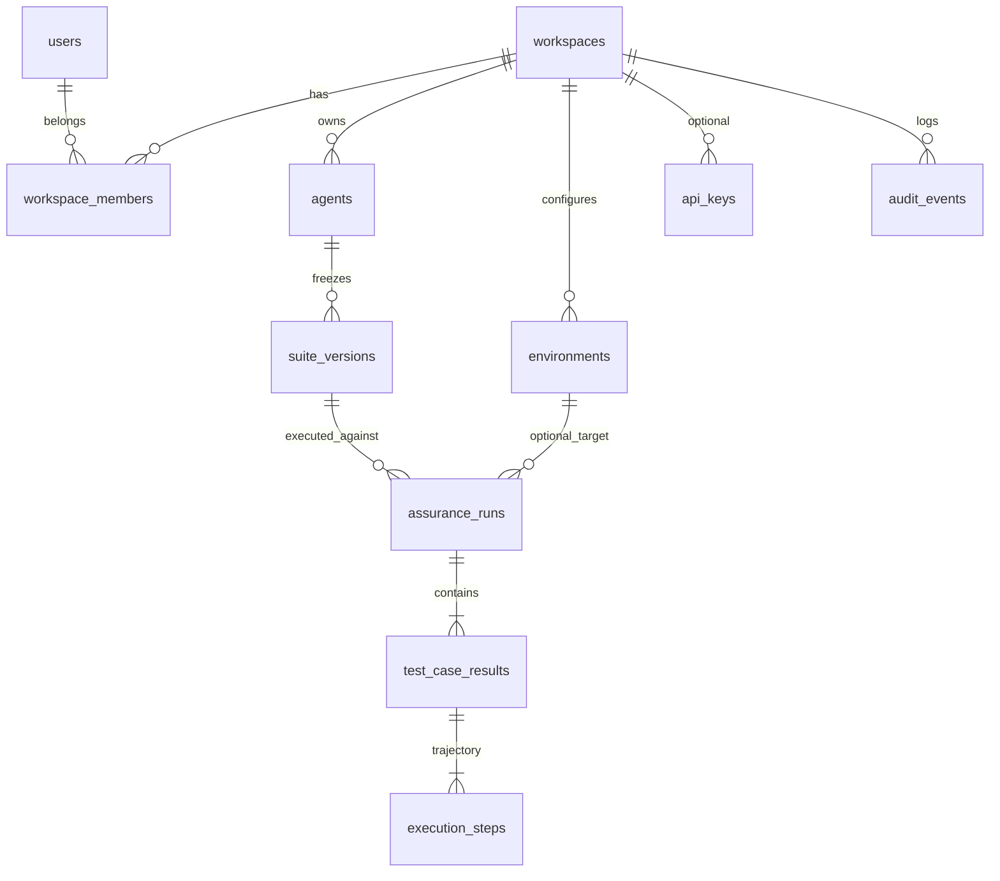

# AgentEval — persistence schema (SQLite v1)

> **ADR:** [ADR-004-sqlite-local-persistence.md](../decisions/ADR-004-sqlite-local-persistence.md)  
> **Skill:** data-storage — relational default, model access paths first, SQLite until scale demands Postgres.  
> **Maps from today:** `SuiteStore` JSON files → normalized rows + JSON snapshots where bulk is rare.

## Design principles

1. **Tenant boundary:** Every agent, suite, and run belongs to a **workspace**. Users access via **membership**.
2. **Freeze is immutable:** A `suite_version` row is append-only; new freeze → new `version` number. Tests at freeze time are snapshotted.
3. **Run is append-only:** Each assurance run inserts `assurance_runs` + `test_case_results` + `execution_steps` (sealed at run time per [execution_trace.py](../../agenteval/planning/execution_trace.py)).
4. **No demo columns:** UI/API read these tables (or repository DTOs), not client-side synthesis.
5. **JSON TEXT in SQLite:** `observation_json`, `action_args_json`, `run_diff_json`, `pack_json` — validate with Pydantic on read/write. Postgres migration → `JSONB`.

## Entity relationship (v1)



## Access patterns (drives indexes)

| Query | Tables | Index |
|-------|--------|--------|
| List agents in workspace | `agents` | `(workspace_id)` |
| Latest suite version for agent | `suite_versions` | `(agent_id, version DESC)` |
| List runs for agent (newest first) | `assurance_runs` | `(agent_id, started_at DESC)` |
| Run detail + all test results | `assurance_runs`, `test_case_results` | `(run_id)` |
| Trajectory replay for one test | `execution_steps` | `(test_case_result_id, step_index)` |
| User’s workspaces | `workspace_members` | `(user_id)` |
| Audit trail | `audit_events` | `(workspace_id, created_at DESC)` |

## Table definitions

### Identity & tenancy

```sql
CREATE TABLE users (
    id            TEXT PRIMARY KEY,  -- uuid
    email         TEXT NOT NULL UNIQUE,
    display_name  TEXT NOT NULL DEFAULT '',
    password_hash TEXT,              -- null when SSO-only later
    created_at    TEXT NOT NULL      -- ISO-8601 UTC
);

CREATE TABLE workspaces (
    id         TEXT PRIMARY KEY,
    slug       TEXT NOT NULL UNIQUE,  -- acme-ai-core → app.agenteval.app/acme-ai-core
    name       TEXT NOT NULL,
    created_at TEXT NOT NULL
);

CREATE TABLE workspace_members (
    workspace_id TEXT NOT NULL REFERENCES workspaces(id) ON DELETE CASCADE,
    user_id      TEXT NOT NULL REFERENCES users(id) ON DELETE CASCADE,
    role         TEXT NOT NULL CHECK (role IN ('OWNER','ADMIN','MEMBER','VIEWER')),
    created_at   TEXT NOT NULL,
    PRIMARY KEY (workspace_id, user_id)
);
```

### Agents & environments

```sql
CREATE TABLE agents (
    id           TEXT PRIMARY KEY,
    workspace_id TEXT NOT NULL REFERENCES workspaces(id) ON DELETE CASCADE,
    slug         TEXT NOT NULL,       -- demo-refund-agent
    display_name TEXT NOT NULL,
    created_at   TEXT NOT NULL,
    UNIQUE (workspace_id, slug)
);

CREATE TABLE environments (
    id           TEXT PRIMARY KEY,
    workspace_id TEXT NOT NULL REFERENCES workspaces(id) ON DELETE CASCADE,
    name         TEXT NOT NULL,       -- Staging, Local, CI
    base_url     TEXT NOT NULL,       -- https://staging.acme.com/v1/chat
    is_default   INTEGER NOT NULL DEFAULT 0,
    created_at   TEXT NOT NULL
);
```

### Frozen suites (replaces per-agent JSON dir metadata + pack files)

```sql
CREATE TABLE suite_versions (
    id                       TEXT PRIMARY KEY,
    agent_id                 TEXT NOT NULL REFERENCES agents(id) ON DELETE CASCADE,
    version                  INTEGER NOT NULL CHECK (version >= 1),
    requirements_fingerprint TEXT NOT NULL,
    requirements_text        TEXT NOT NULL,   -- PRD markdown at freeze time
    endpoint_profile         TEXT NOT NULL DEFAULT '',
    pack_json                TEXT NOT NULL,   -- serialized TestPack (optimized tests)
    candidate_pool_json      TEXT,            -- optional full pool snapshot
    agent_card_json          TEXT,            -- optional AgentCard snapshot
    created_at               TEXT NOT NULL,
    created_by_user_id       TEXT REFERENCES users(id),
    UNIQUE (agent_id, version)
);
```

`pack_json` / `candidate_pool_json` match `TestPack` and `list[CandidateTest]` from the API today. Normalizing each test into rows is **Phase 2** if we need SQL analytics on coverage tags; v1 keeps freeze snapshot as JSON for minimal migration from `test_pack.json`.

### Assurance runs & sealed evidence

```sql
CREATE TABLE assurance_runs (
    run_id           TEXT PRIMARY KEY,   -- e.g. uuid hex[:12] as today
    agent_id         TEXT NOT NULL REFERENCES agents(id) ON DELETE CASCADE,
    suite_version_id TEXT NOT NULL REFERENCES suite_versions(id),
    environment_id   TEXT REFERENCES environments(id),
    endpoint_url     TEXT NOT NULL,      -- actual URL used for POST
    started_at       TEXT NOT NULL,
    finished_at      TEXT NOT NULL,
    passed           INTEGER NOT NULL DEFAULT 0,
    failed           INTEGER NOT NULL DEFAULT 0,
    unverifiable     INTEGER NOT NULL DEFAULT 0,
    run_diff_json    TEXT,               -- SuiteRunDiff serialized
    triggered_by     TEXT,               -- user_id or ci:github:repo:workflow
    FOREIGN KEY (agent_id) REFERENCES agents(id)
);

CREATE TABLE test_case_results (
    id               TEXT PRIMARY KEY,
    run_id           TEXT NOT NULL REFERENCES assurance_runs(run_id) ON DELETE CASCADE,
    test_id          TEXT NOT NULL,      -- stable id within pack
    verdict          TEXT NOT NULL CHECK (verdict IN ('PASS','FAIL','UNVERIFIABLE')),
    rationale        TEXT NOT NULL DEFAULT '',
    observation_json TEXT NOT NULL,      -- ObservationBundle
    UNIQUE (run_id, test_id)
);

CREATE TABLE execution_steps (
    id                   TEXT PRIMARY KEY,
    test_case_result_id  TEXT NOT NULL REFERENCES test_case_results(id) ON DELETE CASCADE,
    step_index           INTEGER NOT NULL,
    step_id              TEXT NOT NULL,
    kind                 TEXT NOT NULL,
    label                TEXT NOT NULL,
    thought              TEXT NOT NULL DEFAULT '',
    action_tool          TEXT NOT NULL DEFAULT '',
    action_args_json     TEXT NOT NULL DEFAULT '{}',
    observation          TEXT NOT NULL DEFAULT '',
    http_status          INTEGER,
    latency_ms           REAL,
    is_failure           INTEGER NOT NULL DEFAULT 0,
    UNIQUE (test_case_result_id, step_index)
);
```

Maps 1:1 to `ExecutionStep` in `models.py`. Replay UI loads `execution_steps` ordered by `step_index`.

### Governance (SaaS PRD — slice after core runs)

```sql
CREATE TABLE api_keys (
    id           TEXT PRIMARY KEY,
    workspace_id TEXT NOT NULL REFERENCES workspaces(id) ON DELETE CASCADE,
    name         TEXT NOT NULL,
    key_prefix   TEXT NOT NULL,          -- display ae_live_xxxx
    key_hash     TEXT NOT NULL,          -- never store raw secret
    created_at   TEXT NOT NULL,
    revoked_at   TEXT
);

CREATE TABLE audit_events (
    id            TEXT PRIMARY KEY,
    workspace_id  TEXT NOT NULL REFERENCES workspaces(id) ON DELETE CASCADE,
    actor_user_id TEXT REFERENCES users(id),
    action        TEXT NOT NULL,         -- suite.freeze, run.execute, api_key.create
    entity_type   TEXT NOT NULL,
    entity_id     TEXT NOT NULL,
    metadata_json TEXT NOT NULL DEFAULT '{}',
    created_at    TEXT NOT NULL
);
```

### Future: harness / OTel (not v1 SQLite DDL)

| Table | Purpose |
|-------|---------|
| `execution_traces` | Harness profile: full `ExecutionTrace` id, agent_id, run linkage |
| `trace_spans` | OpenInference-compatible spans for multi-turn tool loops |
| `report_artifacts` | HTML report blob path or content hash |

Black-box MVP uses `execution_steps` only; harness replay merges into the same step model or links `execution_traces.id` → `assurance_runs.run_id`.

## Mapping from current `SuiteStore` files

| File today | DB destination |
|------------|----------------|
| `{agent_id}/suite.manifest.json` | `suite_versions` (latest version row) + `agents.slug` |
| `test_pack.json` | `suite_versions.pack_json` |
| `candidate_pool.json` | `suite_versions.candidate_pool_json` |
| `runs/{run_id}.json` | `assurance_runs` + `test_case_results` + `execution_steps` |
| `latest_run.json` | View or query: `ORDER BY started_at DESC LIMIT 1` per agent |

## SQLite bootstrap

```sql
PRAGMA foreign_keys = ON;
PRAGMA journal_mode = WAL;
```

Application:

- **Python:** SQLAlchemy 2.x Core or `sqlite3` + small repository layer; migrations via Alembic when schema stabilizes.
- **Config:** `AGENTEVAL_DATABASE_URL=sqlite:///.agenteval/agenteval.db`
- **Tests:** `:memory:` or temp file per pytest session.

## Postgres migration notes (later)

- Same table names; `TEXT` JSON → `JSONB`; `INTEGER` booleans → `BOOLEAN`.
- Add `workspace_id` to `assurance_runs` denormalized for partition-by-tenant if needed.
- Row-level security policies per `workspace_id` when multi-tenant hosted.

## Implementation order (suggested)

1. **`schema.sql`** + migration `v001` applying DDL (no app wire yet).
2. **`SuiteRepository`** — `save_run`, `load_latest_run`, `init_suite` mirroring `SuiteStore` API.
3. **Wire `SuiteWorkflow`** — feature flag `AGENTEVAL_USE_SQLITE=1`.
4. **Import tool** — one-shot ingest from `.agenteval/suites/**` JSON into SQLite.
5. **Auth tables** — when sign-up slice ships; until then single default workspace in seed data.

## Seed for local dev (conceptual)

One workspace `local-dev`, one user, one agent `demo-refund-agent`, optional environment `Local` → `http://127.0.0.1:8765/chat`. Matches web `WorkspaceContext` defaults without fake run data.
