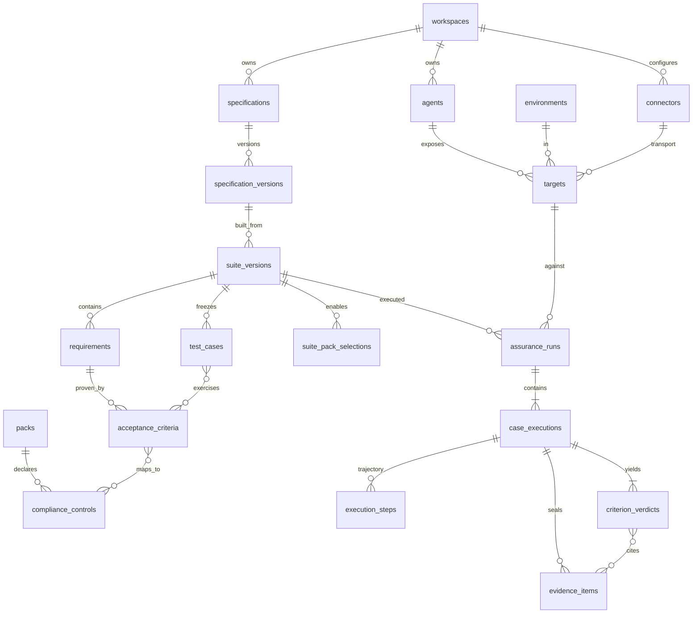

# AgentEval — persistence schema (SQLite v2, draft)

> **ADRs:** [ADR-004](../decisions/ADR-004-sqlite-local-persistence.md) (SQLite),
> [ADR-005](../decisions/ADR-005-backbone-domain-packs-source-of-truth.md) (packs,
> SQLite source of truth + Inspect logs alongside, one target per run, stored test data)  
> **Domain model:** [domain-model.md](domain-model.md)  
> **DDL file (not wired yet):** [schema_v2.sql](../../agenteval/db/schema_v2.sql)  
> **Replaces:** v1 sections of this doc and [schema.sql](../../agenteval/db/schema.sql) once migration ships.

## Design principles

1. **SQLite is authoritative** for API, UI, and reports. Each run also stores an Inspect `EvalLog` path + SHA-256; logs are audit and re-score input, not the primary query surface.
2. **Tenant boundary:** workspaces own agents, targets, connectors, and specifications.
3. **Freeze is immutable:** a `suite_versions` row with `status = 'frozen'` never updates child rows; changes create a new suite version.
4. **One target per run:** `assurance_runs.target_id` is required (v1 allowed `environment_id` + `endpoint_url` only).
5. **Reproducible runs:** `test_cases.test_data_json` is set at freeze and replayed; runs do not regenerate pack data.
6. **Per-criterion verdicts:** `criterion_verdicts` is the sign-off unit (FR-B-14); `test_case_results.verdict` becomes a derived rollup during transition.
7. **JSON TEXT:** large or rare blobs stay in validated JSON columns until Postgres `JSONB`; normalize hot paths (requirements, criteria, verdicts).

## Entity relationship (v2)



Tenancy tables (`users`, `workspace_members`, `api_keys`, `audit_events`) unchanged from v1; omitted from the diagram.

## Access patterns (drives indexes)

| Query | Tables | Index |
|-------|--------|--------|
| List agents in workspace | `agents` | `(workspace_id)` |
| Latest frozen suite for agent | `suite_versions` | `(agent_id, status, version DESC)` |
| Requirements for suite version | `requirements` | `(suite_version_id)` |
| Criteria for requirement | `acceptance_criteria` | `(requirement_id)` |
| Test cases in frozen suite | `test_cases` | `(suite_version_id)` |
| Runs for agent (newest) | `assurance_runs` | `(agent_id, started_at DESC)` |
| Run + per-criterion verdicts | `criterion_verdicts`, `case_executions` | `(run_id)` via executions |
| Report by compliance control | `compliance_controls`, `criterion_compliance_map`, `criterion_verdicts` | `(control_id, run_id)` |
| Trajectory replay | `execution_steps` | `(case_execution_id, step_index)` |
| Installed packs | `packs` | `(name, version DESC)` |

## Table definitions

### Identity and tenancy (unchanged from v1)

Keep `users`, `workspaces`, `workspace_members`, `api_keys`, `audit_events` as in [schema.sql](../../agenteval/db/schema.sql).

### Agents and environments (unchanged)

Keep `agents`, `environments` as in v1.

### Connectors and targets (new)

```sql
CREATE TABLE connectors (
    id            TEXT PRIMARY KEY,
    workspace_id  TEXT NOT NULL REFERENCES workspaces(id) ON DELETE CASCADE,
    slug          TEXT NOT NULL,
    kind          TEXT NOT NULL CHECK (kind IN ('http_transport','mcp_transport','db_diff','audit_log','trace')),
    config_json   TEXT NOT NULL DEFAULT '{}',
    created_at    TEXT NOT NULL,
    UNIQUE (workspace_id, slug)
);

CREATE TABLE targets (
    id                     TEXT PRIMARY KEY,
    workspace_id           TEXT NOT NULL REFERENCES workspaces(id) ON DELETE CASCADE,
    agent_id               TEXT NOT NULL REFERENCES agents(id) ON DELETE CASCADE,
    environment_id         TEXT REFERENCES environments(id),
    display_name           TEXT NOT NULL,
    transport_connector_id TEXT NOT NULL REFERENCES connectors(id),
    created_at             TEXT NOT NULL
);

CREATE TABLE target_evidence_connectors (
    target_id    TEXT NOT NULL REFERENCES targets(id) ON DELETE CASCADE,
    connector_id TEXT NOT NULL REFERENCES connectors(id) ON DELETE CASCADE,
    PRIMARY KEY (target_id, connector_id)
);
```

`connectors.config_json` holds endpoint URL, headers, DB path, etc. (validated Pydantic). A **target** is what a run executes against (ADR-005: one target per run).

### Specifications (new)

```sql
CREATE TABLE specifications (
    id           TEXT PRIMARY KEY,
    workspace_id TEXT NOT NULL REFERENCES workspaces(id) ON DELETE CASCADE,
    slug         TEXT NOT NULL,
    title        TEXT NOT NULL,
    created_at   TEXT NOT NULL,
    UNIQUE (workspace_id, slug)
);

CREATE TABLE specification_versions (
    id                TEXT PRIMARY KEY,
    specification_id  TEXT NOT NULL REFERENCES specifications(id) ON DELETE CASCADE,
    version           INTEGER NOT NULL CHECK (version >= 1),
    body_text         TEXT NOT NULL,
    body_sha256       TEXT NOT NULL,
    created_at        TEXT NOT NULL,
    created_by_user_id TEXT REFERENCES users(id),
    UNIQUE (specification_id, version)
);
```

### Packs and compliance (new)

Pack **binaries** ship as Python packages; the DB records what was enabled at freeze time.

```sql
CREATE TABLE packs (
    id              TEXT PRIMARY KEY,
    name            TEXT NOT NULL,
    version         TEXT NOT NULL,
    manifest_json   TEXT NOT NULL DEFAULT '{}',
    installed_at    TEXT NOT NULL,
    UNIQUE (name, version)
);

CREATE TABLE compliance_controls (
    id           TEXT PRIMARY KEY,
    pack_id      TEXT NOT NULL REFERENCES packs(id) ON DELETE CASCADE,
    control_key  TEXT NOT NULL,
    title        TEXT NOT NULL,
    framework    TEXT NOT NULL DEFAULT '',
    UNIQUE (pack_id, control_key)
);
```

### Suite versions — draft and frozen (evolve v1)

```sql
CREATE TABLE suite_versions (
    id                       TEXT PRIMARY KEY,
    agent_id                 TEXT NOT NULL REFERENCES agents(id) ON DELETE CASCADE,
    version                  INTEGER NOT NULL CHECK (version >= 1),
    status                   TEXT NOT NULL CHECK (status IN ('draft','frozen')) DEFAULT 'draft',
    specification_version_id TEXT REFERENCES specification_versions(id),
    requirements_fingerprint TEXT NOT NULL,
    requirements_text        TEXT NOT NULL,
    endpoint_profile         TEXT NOT NULL DEFAULT '',
    candidate_pool_json      TEXT,
    agent_card_json          TEXT,
    pack_json                TEXT,
    frozen_at                TEXT,
    created_at               TEXT NOT NULL,
    created_by_user_id       TEXT REFERENCES users(id),
    UNIQUE (agent_id, version)
);

CREATE TABLE suite_pack_selections (
    suite_version_id TEXT NOT NULL REFERENCES suite_versions(id) ON DELETE CASCADE,
    pack_id          TEXT NOT NULL REFERENCES packs(id),
    options_json     TEXT NOT NULL DEFAULT '{}',
    PRIMARY KEY (suite_version_id, pack_id)
);
```

During migration, `pack_json` remains a denormalized `TestPack` snapshot (v1 behavior). New freezes also populate normalized `requirements`, `acceptance_criteria`, and `test_cases`. When import is complete, `pack_json` becomes optional cache.

### Requirements and acceptance criteria (new)

```sql
CREATE TABLE requirements (
    id               TEXT PRIMARY KEY,
    suite_version_id TEXT NOT NULL REFERENCES suite_versions(id) ON DELETE CASCADE,
    stable_id        TEXT NOT NULL,
    statement        TEXT NOT NULL,
    source_kind      TEXT NOT NULL CHECK (source_kind IN ('spec','pack')),
    source_pack_id   TEXT REFERENCES packs(id),
    review_status    TEXT NOT NULL CHECK (review_status IN ('proposed','approved','rejected')) DEFAULT 'proposed',
    UNIQUE (suite_version_id, stable_id)
);

CREATE TABLE acceptance_criteria (
    id               TEXT PRIMARY KEY,
    requirement_id   TEXT NOT NULL REFERENCES requirements(id) ON DELETE CASCADE,
    stable_id        TEXT NOT NULL,
    description      TEXT NOT NULL,
    evidence_kind    TEXT NOT NULL,
    check_kind       TEXT NOT NULL,
    source_kind      TEXT NOT NULL CHECK (source_kind IN ('extracted','pack','user')),
    source_pack_id   TEXT REFERENCES packs(id),
    UNIQUE (requirement_id, stable_id)
);

CREATE TABLE criterion_compliance_map (
    criterion_id TEXT NOT NULL REFERENCES acceptance_criteria(id) ON DELETE CASCADE,
    control_id   TEXT NOT NULL REFERENCES compliance_controls(id) ON DELETE CASCADE,
    PRIMARY KEY (criterion_id, control_id)
);
```

`stable_id` survives PRD heading renames (FR-B-02). Pack-sourced rows set `source_pack_id` (FR-B-22).

### Test cases (new)

```sql
CREATE TABLE test_cases (
    id               TEXT PRIMARY KEY,
    suite_version_id TEXT NOT NULL REFERENCES suite_versions(id) ON DELETE CASCADE,
    stable_id        TEXT NOT NULL,
    title            TEXT NOT NULL DEFAULT '',
    persona_json     TEXT NOT NULL DEFAULT '{}',
    inputs_json      TEXT NOT NULL DEFAULT '{}',
    test_data_json   TEXT NOT NULL DEFAULT '{}',
    UNIQUE (suite_version_id, stable_id)
);

CREATE TABLE test_case_criteria (
    test_case_id TEXT NOT NULL REFERENCES test_cases(id) ON DELETE CASCADE,
    criterion_id TEXT NOT NULL REFERENCES acceptance_criteria(id) ON DELETE CASCADE,
    PRIMARY KEY (test_case_id, criterion_id)
);
```

`test_data_json` is frozen at suite freeze and replayed on every run (ADR-005).

### Runs, executions, evidence, verdicts (evolve v1)

```sql
CREATE TABLE assurance_runs (
    run_id             TEXT PRIMARY KEY,
    agent_id           TEXT NOT NULL REFERENCES agents(id) ON DELETE CASCADE,
    suite_version_id   TEXT NOT NULL REFERENCES suite_versions(id),
    target_id          TEXT NOT NULL REFERENCES targets(id),
    baseline_run_id    TEXT REFERENCES assurance_runs(run_id),
    started_at         TEXT NOT NULL,
    finished_at        TEXT,
    status             TEXT NOT NULL CHECK (status IN ('queued','running','completed','failed','cancelled')) DEFAULT 'queued',
    passed             INTEGER NOT NULL DEFAULT 0,
    failed             INTEGER NOT NULL DEFAULT 0,
    unverifiable       INTEGER NOT NULL DEFAULT 0,
    run_diff_json      TEXT,
    inspect_log_path   TEXT,
    inspect_log_sha256 TEXT,
    triggered_by       TEXT
);

CREATE TABLE case_executions (
    id               TEXT PRIMARY KEY,
    run_id           TEXT NOT NULL REFERENCES assurance_runs(run_id) ON DELETE CASCADE,
    test_case_id     TEXT NOT NULL REFERENCES test_cases(id),
    verdict_rollup   TEXT CHECK (verdict_rollup IN ('PASS','FAIL','UNVERIFIABLE')),
    rationale        TEXT NOT NULL DEFAULT '',
    observation_json TEXT NOT NULL DEFAULT '{}',
    UNIQUE (run_id, test_case_id)
);

CREATE TABLE execution_steps (
    id                  TEXT PRIMARY KEY,
    case_execution_id   TEXT NOT NULL REFERENCES case_executions(id) ON DELETE CASCADE,
    step_index          INTEGER NOT NULL,
    step_id             TEXT NOT NULL,
    kind                TEXT NOT NULL,
    label               TEXT NOT NULL,
    thought             TEXT NOT NULL DEFAULT '',
    action_tool         TEXT NOT NULL DEFAULT '',
    action_args_json    TEXT NOT NULL DEFAULT '{}',
    observation         TEXT NOT NULL DEFAULT '',
    http_status         INTEGER,
    latency_ms          REAL,
    is_failure          INTEGER NOT NULL DEFAULT 0,
    UNIQUE (case_execution_id, step_index)
);

CREATE TABLE evidence_items (
    id                 TEXT PRIMARY KEY,
    case_execution_id  TEXT NOT NULL REFERENCES case_executions(id) ON DELETE CASCADE,
    connector_id       TEXT REFERENCES connectors(id),
    kind               TEXT NOT NULL,
    payload_json       TEXT NOT NULL,
    content_sha256     TEXT NOT NULL,
    captured_at        TEXT NOT NULL
);

CREATE TABLE criterion_verdicts (
    id                 TEXT PRIMARY KEY,
    case_execution_id  TEXT NOT NULL REFERENCES case_executions(id) ON DELETE CASCADE,
    criterion_id       TEXT NOT NULL REFERENCES acceptance_criteria(id),
    verdict            TEXT NOT NULL CHECK (verdict IN ('PASS','FAIL','UNVERIFIABLE')),
    verdict_tier       TEXT NOT NULL CHECK (verdict_tier IN ('deterministic','model_judged')) DEFAULT 'deterministic',
    rationale          TEXT NOT NULL DEFAULT '',
    UNIQUE (case_execution_id, criterion_id)
);

CREATE TABLE criterion_verdict_evidence (
    verdict_id        TEXT NOT NULL REFERENCES criterion_verdicts(id) ON DELETE CASCADE,
    evidence_item_id  TEXT NOT NULL REFERENCES evidence_items(id) ON DELETE CASCADE,
    PRIMARY KEY (verdict_id, evidence_item_id)
);
```

**Invariant (app-enforced):** `PASS` / `FAIL` rows in `criterion_verdicts` must have ≥1 row in `criterion_verdict_evidence`; otherwise verdict must be `UNVERIFIABLE` (FR-B-15).

**Transition:** v1 `test_case_results` maps to `case_executions` with `test_case_id` resolved from `pack_json` or new `test_cases.stable_id`. Rollup `verdict_rollup` mirrors today's per-test verdict until UI reads `criterion_verdicts`.

## Mapping from v1 schema and `SuiteStore`

| v1 | v2 |
|----|-----|
| `suite_versions.pack_json` | `test_cases` + `requirements` + `acceptance_criteria`; keep `pack_json` until backfill done |
| `suite_versions` (always frozen implicitly) | `status = 'frozen'`; new drafts before freeze |
| `assurance_runs.environment_id`, `endpoint_url` | `targets` + `connectors`; run stores `target_id` |
| `test_case_results` | `case_executions` |
| `execution_steps.test_case_result_id` | `execution_steps.case_execution_id` |
| (missing) | `criterion_verdicts`, `evidence_items`, Inspect log columns |
| `{agent_id}/requirements` in JSON | `specification_versions` + `requirements` |

| File today (`SuiteStore`) | DB destination |
|---------------------------|----------------|
| `suite.manifest.json` | `suite_versions` + `agents` |
| `test_pack.json` | normalized rows + optional `pack_json` cache |
| `candidate_pool.json` | `candidate_pool_json` |
| `runs/{run_id}.json` | `assurance_runs` + `case_executions` + steps + verdicts |
| Inspect log (future) | `{data_dir}/runs/{run_id}/eval.json` + `inspect_log_*` columns |

## Migration plan (phased)

```text
Phase 0 (now)     Document v2 DDL; no app wire
Phase 1           Alembic v002: add new tables; nullable target_id; dual-write optional
Phase 2           Import tool: JSON suites → v2 rows; synthesize default target from endpoint_url
Phase 3           SuiteWorkflow writes requirements/criteria/test_cases on freeze
Phase 4           Runner writes criterion_verdicts + evidence_items; copy Inspect log
Phase 5           API/UI read verdicts; deprecate test_case_results table
Phase 6           Drop pack_json requirement; CI boundary check (NFR-B-07)
```

Default target for legacy imports: one `http_transport` connector per environment URL, one target per agent+environment pair.

## SQLite bootstrap

```sql
PRAGMA foreign_keys = ON;
PRAGMA journal_mode = WAL;
```

Application: same as v1 (`AGENTEVAL_DATABASE_URL`, `SuiteRepository` → split repositories per aggregate later).

## Postgres migration notes (later)

Same table names; JSON columns → `JSONB`; add RLS on `workspace_id` where denormalized.

## Code module map (planned, not implemented)

| Area | v1 today | v2 action |
|------|----------|-----------|
| `agenteval/db/schema.sql` | v1 DDL | **Change** → apply `schema_v2.sql` via migration |
| `agenteval/db/suite_repository.py` | pack_json runs | **Change** → freeze writes normalized rows |
| `agenteval/planning/suite_store.py` | JSON files | **Keep** until import + flag; then thin adapter |
| `agenteval/planning/blackbox_runner.py` | per-test verdict | **Change** → criterion verdicts + evidence |
| `agenteval/planning/observable_scorer.py` | test-level | **Change** → per-criterion + evidence kinds |
| `agenteval/planning/models.py` | TestPack-centric | **Change** → domain model DTOs |
| `agenteval/ingest/requirements.py` | blob text | **Change** → `requirements` with stable IDs |
| Domain presets in `web/`, `gap_loop`, personas | refund/ticket wording | **Move** → fintech pack (first) |
| `agenteval/api/schemas.py`, `suite_workflow.py` | suite/run DTOs | **Change** → expose requirements + verdicts |
| Inspect integration | none | **Add** hook + log path persistence |

## Implementation order (next slices)

1. Land `schema_v2.sql` + Alembic `v002` (additive only; v1 tables remain).
2. Pydantic models for `Requirement`, `AcceptanceCriterion`, `CriterionVerdict`, `EvidenceItem`.
3. Stable requirement ID fix in ingest (heading-rename bug) writing to draft suite rows.
4. Import command: existing DB/JSON → v2 tables + default target.
5. Runner slice: seal evidence + per-criterion verdict on one black-box path.
6. API `GET /v1/suites/{id}/requirements` and run detail with `criterion_verdicts`.

## Seed for local dev (conceptual)

Unchanged: workspace `local-dev`, agent `demo-refund-agent`, environment `Local`, connector `http-local` → sample server URL, target linking agent + connector. No fake run rows.
